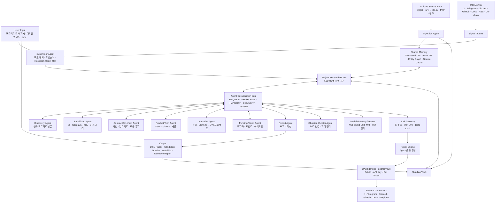
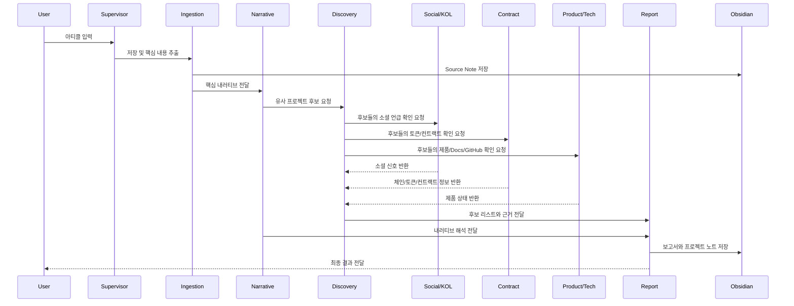
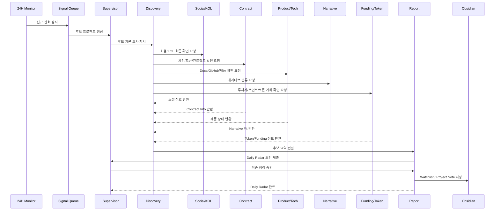
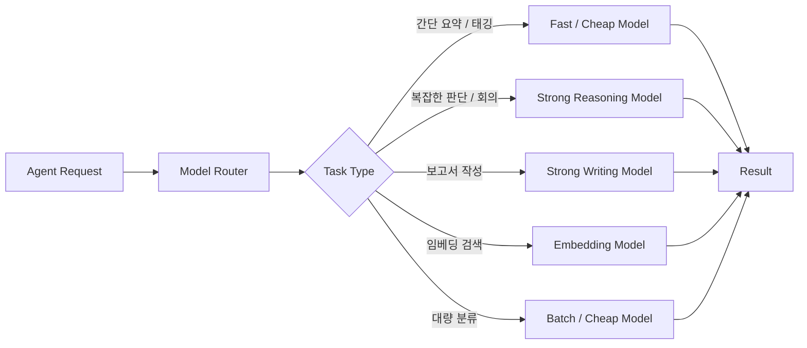
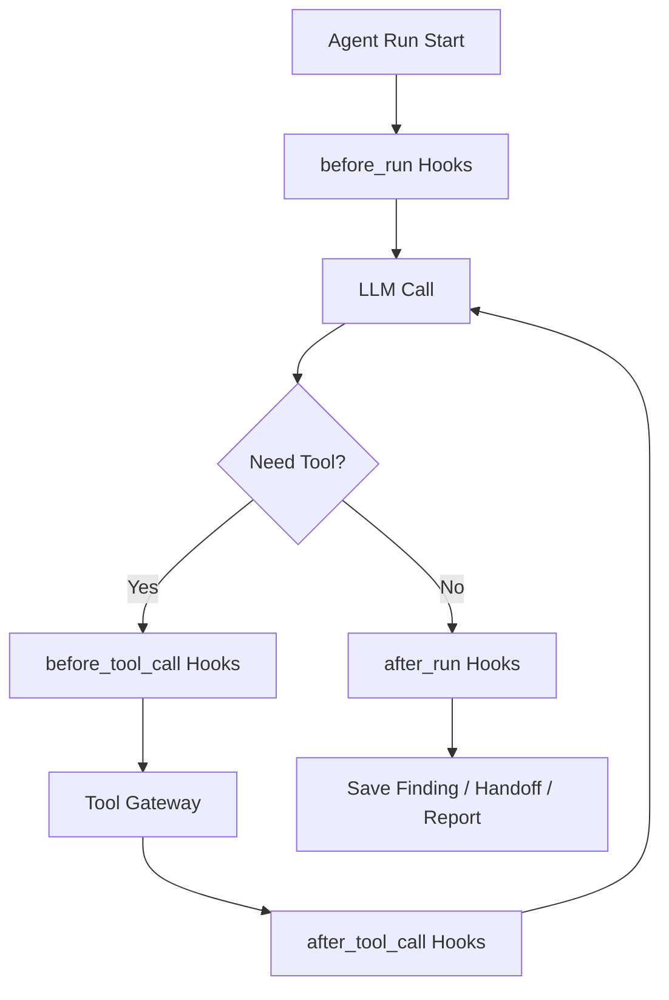

# 멀티에이전트 크립토 리서칭 회사 v1.3

## 0. 시스템 정체성

이 시스템은 거래 실행이나 매매 신호를 만드는 회사가 아니라, 크립토 프로젝트와 내러티브를 조사하는 리서치 회사다.

핵심 구조는 **Controlled P2P Multi-Agent Research Company**다.

```text
Supervisor가 모든 일을 직접 시키는 구조 X
에이전트들이 Agent Collaboration Bus를 통해 서로 요청, 응답, 핸드오프하며 하나의 리서치 결과물을 만드는 구조 O
```

사람 회사에 비유하면 다음과 같다.

```text
대표 / 편집장 = Supervisor Agent
각 리서처 = Specialized Agents
공용 회의실 = Project Research Room
공용 메신저 / 업무 티켓 = Agent Collaboration Bus
공용 자료실 = Shared Memory
사람이 읽는 장기 기억 = Obsidian Vault
최종 리포트 편집자 = Report Agent
```

## 1. 최종 아키텍처



## 2. 핵심 원칙

1. Supervisor는 목표, 우선순위, Research Room 생성만 담당한다.
2. 에이전트 간 협업은 Agent Collaboration Bus를 통해 기록된다.
3. 모든 외부 데이터는 Source ID를 가진다.
4. 에이전트는 자기 전문 분야를 넘어서 판단하지 않는다.
5. 모르는 정보는 만들지 않고 담당 에이전트에게 REQUEST를 보낸다.
6. LLM API Key, OAuth Token, Bot Token은 에이전트가 직접 알지 않는다.
7. 모델 선택은 에이전트가 직접 하지 않고 Model Router가 담당한다.
8. 외부 API 호출은 Tool Gateway와 Policy Engine을 통과한다.
9. Obsidian은 사람이 읽는 장기 기억으로 사용한다.
10. 최종 보고서에는 각 에이전트의 Finding과 출처가 남아야 한다.

## 3. 주요 실행 케이스

### Case 1: 사용자가 아티클을 가져왔을 때

핵심 흐름은 **아티클 -> 기억화 -> 유사 프로젝트 탐색 -> 보고서**다.



### Case 2: 24시간 레이더가 프로젝트를 발견했을 때

핵심 흐름은 **신호 감지 -> 에이전트 협업 -> 후보 점수화 -> Daily Radar**다.



## 4. Project Research Room

프로젝트 하나를 조사할 때마다 임시 협업 공간을 만든다.

```yaml
research_room:
  room_id: room_2026_001
  topic: "AI Agent x On-chain Wallet early projects"
  source_input:
    - article_001
  goal:
    - 아티클 저장
    - 핵심 내러티브 추출
    - 유사 초기 프로젝트 후보 찾기
    - 후보별 간단 보고서 작성
  agents:
    - ingestion_agent
    - discovery_agent
    - social_kol_agent
    - contract_onchain_agent
    - product_tech_agent
    - narrative_agent
    - report_agent
    - obsidian_curator_agent
  status: active
```

내부 구조:

```text
Project Research Room
├── Goal
├── Project Card
├── Agent Tasks
├── Shared Findings
├── Open Questions
├── Report Draft
└── Obsidian Sync
```

## 5. Agent Collaboration Bus

에이전트들은 아래 메시지 타입으로 협업한다.

```text
REQUEST   필요한 정보 요청
RESPONSE  요청에 대한 답변
HANDOFF   작업 결과를 다른 에이전트에게 넘김
COMMENT   다른 에이전트 결과에 의견 추가
UPDATE    Shared Memory나 Obsidian 업데이트 알림
```

메시지 예시:

```yaml
message_id: msg_001
room_id: room_project_abc
from_agent: discovery_agent
to_agent: contract_onchain_agent
type: REQUEST
priority: high
task:
  objective: "Project ABC의 체인, 토큰 유무, 컨트랙트 주소 확인"
  required_output:
    - chain
    - token_exists
    - ticker
    - contract_address
    - explorer_link
    - mainnet_or_testnet
    - source
deadline: "10 minutes"
context:
  project_name: "Project ABC"
  website: "https://..."
  x_account: "https://x.com/..."
```

응답 예시:

```yaml
message_id: msg_002
reply_to: msg_001
room_id: room_project_abc
from_agent: contract_onchain_agent
to_agent: discovery_agent
type: RESPONSE
status: completed
result:
  chain: "Base"
  token_exists: false
  ticker: null
  contract_address: null
  explorer_link: null
  mainnet_or_testnet: "testnet"
  token_status: "pre-token"
  source: "official docs"
confidence: 75
notes:
  - "공식 토큰 컨트랙트는 아직 확인되지 않음"
  - "테스트넷 앱은 존재"
```

## 6. Agent = AgentSpec

에이전트는 LLM 하나로 정의되는 것이 아니라 다음 요소의 조합이다.

```text
Agent = Role + Goal + Tools + Memory Scope + Skills + Hooks + Output Schema + Model Policy
```

초기에는 모든 에이전트가 같은 LLM을 써도 된다. 차이는 AgentSpec으로 만든다.

```yaml
agent_id: social_kol_agent
name: Social / KOL Agent

role:
  description: >
    X, Telegram, Discord, KOL 언급 흐름을 분석하고
    프로젝트의 소셜 모멘텀을 요약한다.
  must_not:
    - 컨트랙트 주소를 최종 판단하지 않는다.
    - 토큰 가격 전망을 단정하지 않는다.
    - 최종 보고서를 작성하지 않는다.

model_policy:
  default_model: fast_reasoning
  escalate_model: strong_reasoning
  escalation_triggers:
    - "서로 상충되는 KOL 해석이 있을 때"
    - "프로젝트 내러티브 분류가 애매할 때"

memory_scope:
  read:
    - kol_db
    - source_cache
    - project_db
    - vector_memory
  write:
    - kol_mentions
    - social_findings
  no_access:
    - oauth_tokens
    - billing
    - user_private_notes

tools:
  allow:
    - x_search_posts
    - x_get_recent_mentions
    - telegram_read_channel
    - discord_read_channel
    - count_mentions
    - calculate_social_momentum
    - update_kol_profile
  deny:
    - x_post_tweet
    - telegram_send_message
    - wallet_sign
    - delete_source

output_schema:
  type: social_finding
  required:
    - project_name
    - social_summary
    - key_accounts
    - mention_trend
    - community_signal
    - confidence
    - sources
```

## 7. Model Gateway / Router

에이전트가 직접 모델을 고르지 않는다. Agent Runtime이 task_type을 보내고 Model Router가 모델을 선택한다.



MVP:

```text
모든 에이전트: 같은 LLM
별도: Embedding 모델
```

V1:

```text
Strong Model: Supervisor, Narrative, Report
Fast/Cheap Model: Ingestion, Social 요약, Contract 정리, Obsidian 노트 생성
Embedding Model: Vector DB 검색
```

## 8. Tool Gateway / OAuth Broker

에이전트에 OAuth를 직접 붙이지 않는다.

```text
Agent
-> Tool Gateway
-> Policy Engine
-> OAuth Broker / Secret Vault
-> External Connector
-> Result Normalizer
-> Agent
```

에이전트가 아는 것은 자신이 호출 가능한 툴뿐이다.

```yaml
agent_id: social_kol_agent
allowed_tools:
  - x.search_posts
  - telegram.read_channel
  - discord.read_channel
  - kol_db.write_mentions
not_allowed:
  - x.post_tweet
  - telegram.delete_message
  - wallet.sign_transaction
```

토큰, API Key, Bot Token은 에이전트 프롬프트나 메모리에 들어가면 안 된다.

## 9. Agent Runtime Hooks

에이전트 실행은 다음 Hook 흐름을 따른다.



필수 Hook:

```text
load_agent_profile
load_project_context
retrieve_relevant_memory
permission_check
attach_credential
rate_limit_check
source_id_writer
audit_log_writer
result_normalizer
finding_writer
handoff_notifier
obsidian_sync
missing_info_checker
cost_guard
fallback_model_selector
```

## 10. Specialized Agents

### Supervisor Agent

역할:

```text
목표 정의
우선순위 결정
Research Room 생성
누락 정보 재요청
보고서 최종 방향 승인
```

### Ingestion Agent

역할:

```text
URL, PDF, 트윗, 리포트, 링크 저장
핵심 주장과 엔티티 추출
Source Note 생성
Vector DB 저장
```

### Discovery Agent

역할:

```text
초기 프로젝트 후보 발굴
유사 프로젝트 탐색
후보 점수화
Watchlist 업데이트
```

### Social/KOL Agent

역할:

```text
KOL 핸들 수집
프로젝트별 언급 흐름 확인
KOL별 반복 언급 추적
소셜 모멘텀 요약
```

### Contract/On-chain Agent

역할:

```text
체인 확인
토큰 유무 확인
공식 컨트랙트 주소 확인
DEX pair 확인
mainnet/testnet 상태 확인
```

깊은 리스크 분석이 아니라 기본 식별 정보 확인이 중심이다.

### Product/Tech Agent

역할:

```text
Website, Docs, GitHub, 제품 상태 확인
live/beta/testnet/waitlist 구분
유사 제품 구조 비교
```

### Narrative Agent

역할:

```text
프로젝트를 시장 내러티브와 연결
과거 저장된 아티클/프로젝트와 비교
Narrative Map 업데이트
```

### Funding/Token Agent

역할:

```text
투자자, 포인트 시스템, 에어드랍 가능성, 토큰 구조 확인
Pre-token DB 업데이트
```

### Report Agent

역할:

```text
모든 Agent Finding 취합
누락 정보 체크
Candidate Dossier / Daily Radar / Narrative Report 작성
출처 목록 정리
```

### Obsidian Curator Agent

역할:

```text
Project Note 생성
Source Note 연결
Narrative Note 연결
KOL Mention History 업데이트
Contract DB 업데이트
Watchlist 업데이트
```

## 11. 최종 보고서 구조

```markdown
# Project Dossier: {{project_name}}

## 1. TL;DR
- 한 줄 요약:
- 왜 지금 볼 만한가:
- 현재 판단: Watch / High Interest / Research More / Pass

## 2. Basic Info
- Website:
- X:
- Telegram/Discord:
- Docs:
- GitHub:
- Chain:
- Category:
- Narrative:

## 3. Contract / Token Info
- Token status:
- Ticker:
- Contract:
- Chain:
- Explorer:
- DEX pair:
- Mainnet/Testnet:

## 4. Why It Appeared
- 발견된 신호:
- 최근 언급:
- 제품/문서 업데이트:
- 유사 프로젝트와의 연결:

## 5. Agent Findings

### Discovery Agent
-

### Social/KOL Agent
-

### Contract/On-chain Agent
-

### Product/Tech Agent
-

### Narrative Agent
-

### Funding/Token Agent
-

## 6. Similar Projects
| Project | Chain | Narrative | Token Status | Why Similar |
|---|---|---|---|---|

## 7. Research Opinion
- Bullish Points:
- Unclear Points:
- Next Watch Points:

## 8. Sources
-
```

## 12. Obsidian 저장 구조

```text
10_Projects/
└── Project ABC.md

20_Sources/
├── Article - AI Wallet Thesis.md
├── Tweet - KOL Mention 001.md
└── Docs - Project ABC.md

30_Narratives/
└── AI x Wallet Automation.md

40_KOLs/
└── KOL Name.md

50_Reports/
└── Project ABC Dossier.md

60_Contract_DB/
└── Project ABC Contract Info.md
```

Project Note 예시:

```markdown
---
type: project
project_name: Project ABC
chain: Base
narrative:
  - AI x Wallet
  - Consumer Crypto
token_status: pre-token
contract_status: no official contract
research_status: watchlist
early_radar_score: 76
last_updated: 2026-06-02
---

# Project ABC

## Summary
Project ABC는 AI 기반 wallet automation 프로젝트로, 현재 토큰은 없고 beta 제품 단계로 보임.

## Agent Findings
- [[Discovery Agent Finding - Project ABC]]
- [[Social Finding - Project ABC]]
- [[Contract Info - Project ABC]]
- [[Product Tech Finding - Project ABC]]
- [[Narrative Map - AI x Wallet]]

## Related Sources
- [[Article - AI Wallet Thesis]]
- [[Tweet - KOL Mention 001]]
- [[Docs - Project ABC]]

## Related Projects
- [[Project DEF]]
- [[Project GHI]]
```

## 13. MVP 구현 순서

### Phase 0: 설계 고정

```text
Research Room schema
Agent message schema
AgentSpec schema
Report template
Obsidian note template
```

### Phase 1: 최소 실행 루프

```text
User input
-> Supervisor
-> Research Room 생성
-> Ingestion
-> Narrative
-> Discovery
-> Report
-> Obsidian 저장
```

### Phase 2: 협업 버스

```text
REQUEST / RESPONSE / HANDOFF / COMMENT / UPDATE 기록
Agent Finding 저장
누락 정보 재요청
```

### Phase 3: 외부 툴

```text
Tool Gateway
Policy Engine
Secret Vault
X / Telegram / GitHub / Docs / Explorer connector
```

### Phase 4: 24H Radar

```text
Scheduler
Signal Queue
Discovery Monitor
Daily Radar Report
Telegram alert
```

### Phase 5: 고도화

```text
Model Router
Entity Graph
KOL Influence Map
Narrative Timeline
Human Approval Dashboard
```

## 14. 현재 기준 한 줄 정의

```text
Supervisor가 프로젝트별 Research Room을 만들고, 각 전문 에이전트가 Agent Collaboration Bus를 통해 서로 질문·응답·핸드오프하면서 조사 결과를 공유한 뒤, Report Agent가 리서치 결과를 조립하고 Obsidian Curator가 모든 지식을 장기 기억으로 저장하는 Controlled P2P 크립토 리서치 회사.
```

## 15. 다음에 추가로 정해야 할 것

```text
1. 첫 MVP의 입력 채널: CLI, Telegram Bot, 웹 UI 중 무엇으로 시작할지
2. Shared Memory 기술 선택: SQLite/Postgres + Vector DB
3. Obsidian Vault 실제 경로
4. X/Twitter 데이터 수집 방식
5. AgentSpec 파일 포맷
6. 첫 번째 테스트 리서치 케이스
```
