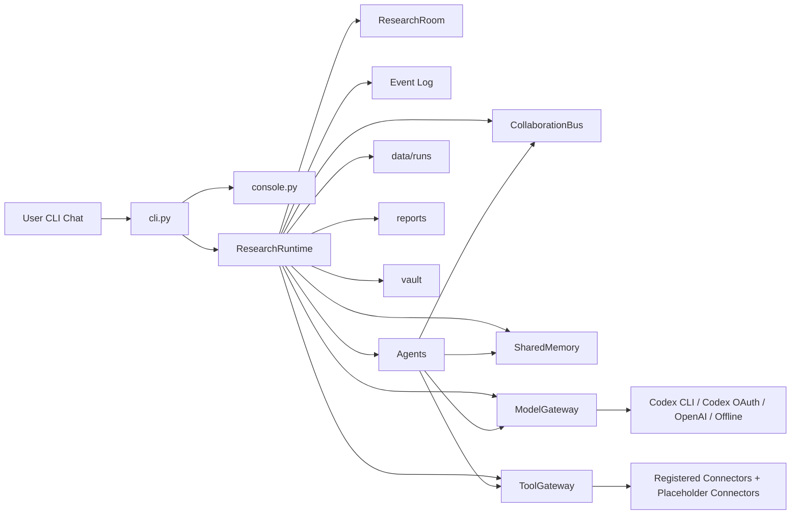

# JIMMORIA Project Structure

이 문서는 JIMMORIA 프로젝트의 전체 구조, 런타임 개념, 에이전트 역할, 데이터 흐름, 저장 위치, 앞으로 붙일 외부 커넥터의 위치를 설명한다.

JIMMORIA는 크립토 가격 매매 도구가 아니라, 리서치 전용 멀티에이전트 회사 CLI다. 사용자는 터미널에서 자연어로 리서치 요청을 입력하고, Supervisor가 Research Room을 열어 여러 전문 에이전트에게 일을 나눈다. 에이전트들은 소스 정리, 내러티브 분석, 초기 프로젝트 후보 발굴, KOL/소셜 체크, 온체인/제품/토큰 체크, 보고서 작성, Obsidian 노트 정리를 수행한다.

현재 버전은 MVP다. 멀티에이전트 협업 구조, 보고서 생성, 런 저장, Obsidian-style 노트 생성은 동작한다. Web Search, URL fetch, Website/Docs crawler, GitHub reader/search, DEX Screener search, CoinGecko search/metadata는 ToolGateway 뒤에 기본 connector로 등록된다. X/Twitter, Telegram, Discord, RootData, Explorer/RPC, funding/airdrop 같은 커넥터는 아직 placeholder 상태다.

## 1. 프로젝트 목표

JIMMORIA의 핵심 목표는 "채팅으로 조종하는 크립토 리서치 회사"를 CLI에서 구현하는 것이다.

사용자가 원하는 주요 작업은 다음과 같다.

- 아티클, 트윗, 링크, PDF, 문서 같은 소스를 넣고 리서치 보고서 생성
- KOL 핸들 목록 수집과 KOL별 언급 프로젝트 추적
- X/Twitter, Telegram, Discord, RSS 등에서 내러티브와 프로젝트 신호 탐지
- 초기에 주목받기 전의 프로젝트 후보 발굴
- Docs, GitHub, 웹사이트, 토큰 상태, 포인트/에어드랍 단서 확인
- 결과를 Markdown 보고서와 Obsidian Vault 형태로 정리
- 나중에 UI에서 에이전트 작업 흐름을 시각적으로 replay할 수 있도록 이벤트 로그 저장

## 2. 최상위 폴더 구조

```text
jimmoria/
  crypto_research_agents/
    cli.py
    console.py
    runtime.py
    agents/
    connectors/
    core/
    storage/

  config/
    agents/
    models/
    skills/
    tools/

  templates/
    obsidian/

  docs/
  tests/

  data/
  reports/
  vault/
```

핵심은 `crypto_research_agents/`가 실제 실행 코드이고, `config/`가 회사의 에이전트 정의와 도구/모델 정책을 담는다는 점이다. `connectors/`는 ToolGateway 뒤에 붙는 실제 외부/HTTP 리서치 도구 구현을 담는다. `data/`, `reports/`, `vault/`는 실행하면서 생성되는 로컬 출력 폴더라 Git에는 올리지 않는다.

## 3. 실행 진입점

설치 후 실행 명령은 다음이다.

```powershell
jimmoria
```

이 명령은 `pyproject.toml`의 script entrypoint로 연결된다.

전체 리서치/LLM/콘솔 도구를 한 번에 설치하려면 다음을 사용한다.

```powershell
python -m pip install -e ".[all]"
```

기본 dependency에는 콘솔 테마 렌더링을 위한 `rich`가 포함된다. `.[all]` extra는 `openai`, `httpx`, `beautifulsoup4`, `feedparser`, `ddgs`까지 설치해서 LLM/API/RSS/HTML/Web Search connector 확장에 필요한 도구를 함께 준비한다.

```toml
[project.scripts]
jimmoria = "crypto_research_agents.cli:main"
crypto-research = "crypto_research_agents.cli:main"
```

즉, `jimmoria`를 치면 `crypto_research_agents/cli.py`의 `main()`이 실행된다.

주요 CLI 명령은 다음과 같다.

```text
jimmoria                    대화형 Research HQ 실행
jimmoria hq                 대화형 Research HQ 실행
jimmoria chat               hq와 같은 채팅형 콘솔
jimmoria demo               내장 데모 리서치 실행
jimmoria research           텍스트, 파일, URL 기반 리서치 실행
jimmoria article            research 별칭
jimmoria add-source         소스만 저장하고 Obsidian Source Note 생성
jimmoria doctor             현재 기능 연결 상태 확인
jimmoria runs               이전 실행 목록
jimmoria status <room_id>   특정 Research Room 상태
jimmoria messages <room_id> 에이전트 협업 메시지
jimmoria events <room_id>   UI/replay 이벤트
jimmoria show-report <id>   저장된 보고서 출력
```

## 4. 전체 아키텍처

JIMMORIA는 controlled P2P 구조다. 모든 에이전트가 완전 자유롭게 서로 호출하는 것이 아니라, Supervisor와 Agent Bus, Shared Memory, Tool Gateway를 중심으로 협업한다.



중앙 개념은 다음과 같다.

| 개념 | 파일 | 역할 |
|---|---|---|
| CLI | `crypto_research_agents/cli.py` | 명령어 파싱, 채팅 루프, 모델 설정 패널 |
| Console | `crypto_research_agents/console.py` | JIMMORIA 로고, 박스형 입력창, 도움말, 실시간 에이전트 상황판 출력 |
| Runtime | `crypto_research_agents/runtime.py` | Research Room 생성과 에이전트 실행 순서 관리 |
| ResearchRoom | `core/room.py` | 하나의 리서치 작업 단위와 상태 |
| CollaborationBus | `core/bus.py` | 에이전트 요청, 응답, 핸드오프, 업데이트 로그 |
| SharedMemory | `core/memory.py` | 소스, 프로젝트 후보, finding, entity graph 저장 |
| ModelGateway | `core/model_gateway.py` | task type에 따라 모델 라우팅 |
| LLM Provider | `core/llm_provider.py` | Codex CLI, Codex OAuth, OpenAI, offline fallback 연결 |
| ToolGateway | `core/tool_gateway.py` | 에이전트별 tool 권한 검사와 audit log |
| Connectors | `connectors/` | Web Search, URL, Website/Docs, GitHub, DEX Screener, CoinGecko connector 등록 |
| Storage | `storage/` | memory, run snapshot, Obsidian note 저장 |

## 5. Research Room 실행 흐름

일반 리서치 요청은 `ResearchRuntime.run_article_research()`로 들어간다.

실행 순서는 현재 다음과 같다.

```text
1. ResearchRoom 생성
2. room_created 이벤트 기록
3. supervisor_agent 실행
4. ingestion_agent 실행
5. narrative_agent 실행
6. discovery_agent 실행
7. social_kol_agent 실행
8. contract_onchain_agent 실행
9. product_tech_agent 실행
10. funding_token_agent 실행
11. report_agent 실행
12. obsidian_curator_agent 실행
13. room_completed 이벤트 기록
14. memory.json, run snapshot, report, vault note 저장
```

상태는 `RuntimeState` 값으로 이동한다.

```text
created
assigned
running
waiting_for_tool
ready_for_report
writing_report
obsidian_syncing
completed
```

현재는 순차 실행에 가깝지만, 구조상 각 에이전트의 요청/응답은 `CollaborationBus`에 기록된다. 나중에 병렬 실행, 비동기 큐, UI replay를 붙일 때 이 bus와 event log가 기반이 된다.

CLI는 `room_created`, `agent_start`, `agent_done`, `agent_failed`, `room_completed` 이벤트를 받아 보라/핑크 테마의 로그를 출력한다. `room_created`와 `room_completed`에는 전체 `Live agent board`를 보여주고, 각 `agent_start`/`agent_done` 이벤트는 짧은 작업 카드로 출력해서 로그가 과도하게 반복되지 않게 한다. 사용자가 작업 지시를 넣으면 각 에이전트가 `WAIT`, `RUN`, `DONE`, `FAIL` 중 어떤 상태인지와 현재 무엇을 하는지 바로 볼 수 있다.

예시:

```text
[Live agent board]
  RUN      ingestion_agent              Now: Storing source input and extracting entities, keywords, metadata
  WAIT     narrative_agent              Waiting: Mapping market narratives and thesis categories
  WAIT     discovery_agent              Waiting: Finding early project candidates from narrative signals
```

## 6. 에이전트 구성

현재 실제 런타임에서 기본 실행되는 에이전트는 `runtime.py`의 `DEFAULT_AGENTS`에 정의된 10개다.

CLI 시작 도움말에는 정적 에이전트 목록을 길게 보여주지 않는다. 대신 사용자가 작업을 입력해 Research Room이 열리면 `Live agent board`와 짧은 agent work cards로 에이전트별 현재 작업 상태가 표시된다. 전체 agent roster와 planned agent까지 보고 싶을 때는 `/company`를 사용한다.

| Agent ID | 구현 클래스 | 역할 | 현재 동작 |
|---|---|---|---|
| `supervisor_agent` | `SupervisorAgent` | 목표와 실행 방향 설정 | Research Room 목표, 참여 에이전트, 모델 선택 정보를 finding으로 기록 |
| `ingestion_agent` | `IngestionAgent` | 소스 저장과 메타데이터 추출 | 입력 소스를 `SharedMemory.sources`에 저장하고 summary/entities/keywords 추출 |
| `narrative_agent` | `NarrativeAgent` | 내러티브 분류 | AI wallet, Consumer Crypto, DeFi Automation 등 taxonomy 기반 narrative 분류 |
| `discovery_agent` | `DiscoveryAgent` | 초기 프로젝트 후보 발굴 | 프로젝트명 기반 요청이면 `web_search`, GitHub, CoinGecko, DEX Screener로 후보를 resolve하고, 일반 내러티브 요청이면 fallback 후보를 생성 |
| `social_kol_agent` | `SocialKOLAgent` | KOL/소셜 신호 확인 | X API는 아직 placeholder지만, web search와 공식 링크에서 social/community URL을 우선 추출 |
| `contract_onchain_agent` | `ContractOnchainAgent` | 체인, 토큰, 컨트랙트 확인 | Explorer/RPC는 아직 placeholder지만 CoinGecko/DEX Screener 결과를 token/market evidence로 반영 |
| `product_tech_agent` | `ProductTechAgent` | Docs, GitHub, 제품 상태 확인 | 등록된 `crawl_website`/`crawl_docs` connector로 URL이 있는 후보의 제품 상태와 공식 링크를 확인 |
| `funding_token_agent` | `FundingTokenAgent` | 투자자, 포인트, 토큰 기회 확인 | RootData/funding connector는 아직 placeholder지만 검색/웹/문서 evidence에서 points, airdrop, mining, ticker 힌트를 추출 |
| `report_agent` | `ReportAgent` | 보고서 작성 | findings와 candidates를 Markdown dossier로 합성하고 Evidence Map에 웹사이트, GitHub, market, search URL을 정리 |
| `obsidian_curator_agent` | `ObsidianCuratorAgent` | Obsidian-style 노트 정리 | Source, Project, Narrative, Report 노트 작성 |

`config/agents/`에는 기본 실행되지 않는 추가 설계용 agent spec도 있다.

| Agent Spec | 상태 | 목적 |
|---|---|---|
| `monitor_24h_agent.yaml` | planned | 24시간 RSS, X, Telegram, GitHub, docs 변화 감지 |
| `memory_retrieval_agent.yaml` | planned | 과거 실행, entity graph, vector memory 검색 |
| `tool_policy_agent.yaml` | planned | tool 권한, secret scan, safety policy 관리 |

이 agent spec들은 아직 `DEFAULT_AGENTS`에 들어가 있지 않지만, 회사 구조 확장 시 추가될 수 있다.

## 7. AgentSpec와 persona YAML

`config/agents/*.yaml`은 각 에이전트의 persona, 역할, 금지사항, tool allowlist, memory 접근 범위, output schema를 정의한다.

이 파일들은 `core/agent_spec.py`의 `AgentSpecRegistry.load_dir()`로 로드된다.

AgentSpec이 담는 주요 필드는 다음이다.

```text
agent_id
name
persona_name
identity
personality
mission
scope
model_policy
memory_scope
tools.allow
tools.deny
hooks
output_schema
collaboration
must_follow
must_not
```

에이전트는 실행 중 `self.system_prompt()`를 통해 이 YAML 내용을 LLM system prompt로 변환한다. 그래서 코드는 에이전트의 행동 골격을 담당하고, YAML은 그 에이전트가 어떤 회사원처럼 행동해야 하는지를 정의한다.

## 8. Collaboration Bus

`core/bus.py`의 `CollaborationBus`는 append-only 협업 기록이다.

메시지 타입은 크게 다음과 같다.

```text
REQUEST   한 에이전트가 다른 에이전트에게 작업 요청
RESPONSE  요청에 대한 결과 반환
HANDOFF   다음 에이전트에게 컨텍스트 넘김
UPDATE    전체 혹은 특정 대상에게 상태 공유
```

예를 들어 `discovery_agent`는 후보 프로젝트를 만든 뒤 다음 에이전트들에게 요청을 보낸다.

```text
discovery_agent -> social_kol_agent
discovery_agent -> contract_onchain_agent
discovery_agent -> product_tech_agent
discovery_agent -> funding_token_agent
```

이 기록은 실행 후 `data/runs/<room_id>/messages.json`에 저장된다. 나중에 CLI나 웹 UI에서 "누가 누구에게 무엇을 요청했는지" 보여줄 때 핵심 데이터가 된다.

## 9. Shared Memory

`core/memory.py`의 `SharedMemory`는 회사의 공통 기억이다.

현재 저장하는 데이터는 다음이다.

| 데이터 | 클래스 | 설명 |
|---|---|---|
| Source | `SourceRecord` | 사용자가 넣은 아티클, 링크, 텍스트, 원문과 메타데이터 |
| Project | `ProjectCandidate` | discovery 단계에서 만들어진 후보 프로젝트 |
| Finding | `FindingRecord` | 각 에이전트가 남긴 조사 결과 |
| Entity Graph | `dict[str, set[str]]` | 프로젝트와 narrative 등 엔티티 관계 |

`SourceRecord`에는 `content_hash`, `canonical_url`, `captured_at`, `raw_path`, `source_quality_score`가 포함된다. 같은 canonical URL이나 같은 content hash가 다시 들어오면 `SharedMemory.add_source()`가 기존 SourceRecord를 재사용해서 중복 ingestion을 줄인다.

실행 중에는 메모리 객체로 존재하고, 실행 후 `storage/json_store.py`를 통해 `data/memory.json`에 저장된다.

현재는 간단한 JSON 메모리다. 나중에 붙일 수 있는 확장 방향은 다음이다.

- SQLite/Postgres 기반 project DB
- vector DB 기반 source retrieval
- KOL profile DB
- entity graph persistence
- run 간 중복 프로젝트 dedupe

## 10. Model Gateway와 LLM Provider

모델 호출은 에이전트가 직접 모델을 고르는 방식이 아니라 `ModelGateway`를 통한다.

`core/model_gateway.py`는 `task_type`에 따라 모델 route를 선택한다.

| Task Type | Route |
|---|---|
| `source_ingestion` | fast/default model |
| `narrative_reasoning` | reasoning model |
| `supervision` | reasoning model |
| `report_writing` | writing model |
| `final_synthesis` | writing model |
| `embedding_search` | embedding model |

실제 provider는 `core/llm_provider.py`에서 결정된다.

| Provider | 조건 | 설명 |
|---|---|---|
| `codex_cli` | `LLM_PROVIDER=codex_cli` | 로컬 Codex CLI 로그인 세션으로 `codex exec` 호출 |
| `codex_oauth` | `CODEX_OAUTH_TOKEN` 등 명시적 token source | OpenAI-compatible endpoint에 bearer token으로 요청 |
| `openai` | `OPENAI_API_KEY` | OpenAI Python SDK 사용 |
| `offline_fallback` | 설정 없음 | deterministic local fallback, 테스트와 MVP 안전장치 |

`codex_cli` provider는 `codex exec --help`를 읽고 현재 설치된 Codex CLI가 지원하는 옵션만 붙인다. 예를 들어 어떤 버전은 `--ask-for-approval`을 지원하지 않으므로, JIMMORIA는 이 옵션을 하드코딩하지 않는다. 현재 provider는 지원 여부를 확인한 뒤 `--ephemeral`, `--skip-git-repo-check`, `--sandbox`, `--output-last-message`, `--model` 같은 옵션을 선택적으로 사용한다. 또한 한국어 리서치 요청이 Windows 코드페이지를 타며 깨지지 않도록 `codex exec -` stdin에는 프롬프트를 UTF-8 bytes로 직접 전달한다. 이 방식은 Codex CLI 버전 차이와 터미널 인코딩 차이 때문에 리서치 런이 중간에 죽는 일을 줄이기 위한 호환성 장치다.

CLI에서 `/models`를 실행하면 모델/provider 설정 화면이 나온다. 설정은 `data/model_settings.json`에 저장된다. 토큰 자체는 저장하지 않고 provider/model preference만 저장한다.

## 11. Tool Gateway와 외부 커넥터

`core/tool_gateway.py`의 `ToolGateway`는 에이전트가 외부 도구를 직접 만지지 않도록 막는 중간 계층이다.

역할은 세 가지다.

```text
1. 에이전트별 tool 권한 검사
2. 실제 tool connector 호출
3. tool audit log 기록
```

`connectors/register_default_connectors()`는 런타임 시작 시 기본 connector를 ToolGateway에 붙인다.

```text
web_search
fetch_url
parse_html
archive_source_snapshot
crawl_website
crawl_docs
github_search_repos
read_github_repo
dexscreener_search_pairs
coingecko_coin_metadata
```

이제 이 tool들은 `unconfigured`가 아니라 실제 connector result를 반환한다. 검색어나 URL이 부족한 경우에는 `missing_input`, 외부 요청이 실패한 경우에는 `failed`, 정상 동작 시에는 `success`로 audit log에 기록된다.

아직 연결되지 않은 외부 tool을 에이전트가 호출하면 다음 같은 결과가 저장된다.

```json
{
  "status": "unconfigured",
  "tool": "x_search_posts",
  "message": "Tool connector is not configured in MVP runtime.",
  "data": null
}
```

이 로그는 `data/runs/<room_id>/tool_audit_log.json`에 저장된다.

필요한 tool 목록과 우선순위는 `config/tools/tool_registry.yaml`에 정리되어 있다. 구현된 connector는 `implementation_status: implemented`로 표시된다.

중요한 live stack은 다음이다. 이 중 Web Search/URL/Website/Docs/GitHub/DEX Screener/CoinGecko 계열은 초안 connector가 구현되어 있고, X/RootData/Explorer/vector 계열은 아직 다음 단계다.

```text
x_search_posts
x_get_user_timeline
x_build_kol_list
rss_monitor_feed
web_search
crawl_website
crawl_docs
github_search_repos
read_github_repo
coingecko_coin_metadata
dexscreener_search_pairs
explorer_lookup
rootdata_search_projects
source_cache_write
vector_search
vector_upsert
render_markdown
write_note
```

## 12. Storage와 출력 파일

JIMMORIA는 실행 결과를 여러 형태로 저장한다.

| 경로 | 설명 |
|---|---|
| `data/memory.json` | 전체 SharedMemory 저장 |
| `data/model_settings.json` | provider/model preference 저장 |
| `data/runs/<room_id>/room.json` | ResearchRoom 상태 저장 |
| `data/runs/<room_id>/messages.json` | CollaborationBus 메시지 저장 |
| `data/runs/<room_id>/tool_audit_log.json` | ToolGateway 호출 기록 |
| `data/runs/<room_id>/llm_call_log.json` | ModelGateway 호출 기록 |
| `data/runs/<room_id>/events.json` | CLI/UI replay용 이벤트 로그 |
| `reports/*.md` | ReportAgent가 작성한 Markdown 보고서 |
| `vault/10_Projects/*.md` | Obsidian project note |
| `vault/20_Sources/*.md` | Obsidian source note |
| `vault/30_Narratives/*.md` | Obsidian narrative note |
| `vault/50_Reports/*.md` | Obsidian report note |

특히 `events.json`은 나중에 시각화 UI를 만들 때 중요하다. 현재 CLI에서는 이벤트를 실시간으로 받아 에이전트 진행 상태를 출력하고, 나중에 웹 화면에서는 이 이벤트 스트림을 replay해서 "어떤 에이전트가 언제 시작했고 언제 끝났는지" 보여줄 수 있다.

## 13. Obsidian Vault 구조

`storage/obsidian_store.py`는 local filesystem 기반 Obsidian-style Vault를 만든다.

```text
vault/
  10_Projects/
  20_Sources/
  30_Narratives/
  50_Reports/
```

각 note는 frontmatter를 포함한다.

Project note 예시 필드:

```yaml
type: project
project_id: proj_xxxxx
project_name: Example
chain: unknown
narrative:
  - AI x Wallet Automation
token_status: unknown
early_radar_score: 65
created_at: ...
```

Source note에는 source_id, source_type, title, url, extracted metadata, content가 들어간다. Report note에는 최종 Markdown dossier가 들어간다.

## 14. 현재 동작하는 리서치 시나리오

### Case 1. 사용자가 아티클이나 리서치 질문을 입력

```text
User input
  -> CLI
  -> ResearchRuntime.run_article_research
  -> Ingestion
  -> Narrative
  -> Discovery
  -> Social / Contract / Product / Funding checks
  -> Report
  -> Obsidian sync
```

이 경우 핵심은 다음이다.

```text
아티클/질문/URL -> 기억화 + source hash/snapshot -> 내러티브 추출 -> 프로젝트명 요청이면 web/GitHub/market search로 후보 resolve -> website/docs/GitHub connector 확인 -> 나머지 미연결 검증은 placeholder -> Evidence Map 포함 보고서
```

### Case 2. 24시간 모니터가 신호를 발견

아직 런타임에 연결되지 않았지만 설계상 흐름은 다음이다.

```text
monitor_24h_agent
  -> signal queue
  -> supervisor_agent
  -> discovery_agent
  -> 검증 에이전트들
  -> daily radar report
  -> Obsidian watchlist
```

이를 위해 `monitor_24h_agent.yaml`과 tool registry의 `monitor_*`, `rss_monitor_feed`, `push_signal_queue` 계열 도구가 준비되어 있다.

## 15. 코드 파일별 설명

### `crypto_research_agents/cli.py`

CLI entrypoint다. 명령어 파싱, interactive chat loop, `/models`, `/doctor`, `/runs`, `/report` 같은 명령 처리, 모델 설정 저장을 담당한다.

중요 함수:

```text
main()
chat_command()
handle_chat_command()
configure_model_panel()
configure_codex_oauth()
configure_model_routes()
doctor_command()
```

### `crypto_research_agents/console.py`

터미널 UI를 담당한다. 시작 로고, 보라/핑크 3D 느낌의 JIMMORIA 배너, 닫힌 박스형 입력창, `/help` 명령어 목록, `rich` 기반 Panel/Table 로그, `Live agent board`, agent work cards, 보고서 preview를 담당한다. `JIMMORIA_PLAIN_LOGS=1`을 설정하면 rich 테마 로그 대신 plain text fallback을 사용할 수 있다.

중요 함수:

```text
JimmoriaConsole.print_intro()
JimmoriaConsole.read_chat_input()
JimmoriaConsole.handle_event()
print_jimmoria_logo()
jimmoria_3d_logo_layers()
```

### `crypto_research_agents/runtime.py`

회사 운영 엔진이다. ResearchRoom을 만들고 정해진 순서대로 에이전트를 실행한다. 각 에이전트 시작/완료 이벤트를 만들고, 실행 후 memory와 run snapshot을 저장한다.

중요 함수:

```text
ResearchRuntime.run_article_research()
ResearchRuntime.run_source_ingestion()
ResearchRuntime._run_agent()
ResearchRuntime._emit()
default_policy()
```

### `crypto_research_agents/agents/`

각 전문 에이전트 구현이 들어 있다.

```text
base.py
supervisor.py
ingestion.py
narrative.py
discovery.py
social_kol.py
contract_onchain.py
product_tech.py
funding_token.py
report.py
obsidian_curator.py
```

### `crypto_research_agents/connectors/`

ToolGateway 뒤에 붙는 실제 connector 구현이다.

```text
__init__.py              register_default_connectors(tool_gateway)
base.py                  normalized success/missing_input/failed result helper
url_fetcher.py           fetch_url, parse_html, crawl_website, crawl_docs, source snapshot
web_search.py            DDGS 기반 public web_search connector
github_connector.py      github_search_repos, read_github_repo
market_connectors.py     dexscreener_search_pairs, coingecko_coin_metadata
```

현재 connector는 비용이 낮고 API key가 거의 필요 없는 public HTTP 기반으로 시작한다. Web Search는 `ddgs`를 사용한다. GitHub는 `GITHUB_TOKEN`이 있으면 사용하지만 없어도 public API로 동작한다. DEX Screener와 CoinGecko도 public endpoint를 먼저 사용한다.

### `crypto_research_agents/core/`

런타임의 공통 도메인 객체가 들어 있다.

```text
agent_spec.py       YAML persona/spec loader
bus.py              CollaborationBus
message.py          AgentMessage model
memory.py           SharedMemory, SourceRecord, ProjectCandidate, FindingRecord, source dedupe
model_gateway.py    model route selector
llm_provider.py     Codex/OpenAI/offline provider
room.py             ResearchRoom
runtime_state.py    room status enum
tool_gateway.py     tool policy, calls, audit log
tool_call.py        tool call record
hooks.py            before/after hook engine
capabilities.py     doctor command capability check
```

### `crypto_research_agents/storage/`

파일 저장 담당이다.

```text
json_store.py       data/memory.json load/save
run_store.py        data/runs/<room_id> snapshot save/load
obsidian_store.py   vault note writer
paths.py            safe filename helper
```

## 16. Config 파일별 설명

### `config/agents/`

에이전트별 persona와 policy다. 코드에서 각 에이전트의 기능 골격을 정의하고, config에서는 그 에이전트가 어떤 관점과 제약으로 일해야 하는지 정의한다.

### `config/models/model_router.yaml`

모델 route와 환경변수 기준이다. 실제 코드의 `ModelGateway`와 CLI model setup이 이 개념을 따른다.

### `config/tools/tool_registry.yaml`

필요하거나 사용하면 좋은 외부 tool 전체 목록이다. 각 tool의 owner agent, priority, implementation status, required secrets, source docs를 담는다.

### `config/skills/`

리서치 workflow 정의다.

```text
article_ingestion.yaml
project_research.yaml
```

현재는 문서/설계 성격이 강하고, 앞으로 runtime이 skill definition을 더 직접 사용하도록 확장할 수 있다.

## 17. 테스트 구조

테스트는 `tests/test_smoke.py`에 모여 있다.

현재 테스트하는 범위는 다음이다.

```text
- JIMMORIA CLI banner
- pyproject script entrypoint
- article research loop output
- agent specs load
- CLI research/events command
- Codex OAuth/Codex CLI/OpenAI/offline provider selection
- Codex CLI exec flag compatibility
- Codex CLI UTF-8 stdin handling for Korean prompts
- model setup flow
- startup model setup skip
- doctor capability status
- tool registry required stack
- tool audit log
- default connector registration
- web search connector registration
- Pearl-style project name discovery candidate resolution
- URL/HTML connector metadata extraction
- SourceRecord content hash/canonical URL dedupe
- boxed chat input prompt
- rich themed runtime log panels
- compact agent work cards
- live agent board current-work display
- purple/pink 3D logo palette
```

실행:

```powershell
python -m unittest discover -s tests -v
```

## 18. 현재 한계

현재 MVP는 리서치 회사의 뼈대와 협업 흐름에 더해, 저비용 HTTP connector 일부가 붙은 단계다.

구체적인 한계는 다음과 같다.

- X/Twitter API가 아직 연결되지 않았다.
- Telegram/Discord reader가 아직 연결되지 않았다.
- Web Search/URL/Website/Docs/GitHub/DEX Screener/CoinGecko는 초안 connector가 등록되어 있지만, 검색 품질은 DDGS/provider 가용성에 영향을 받고, Playwright fallback, sitemap adapter, GitHub commit/release 상세 분석은 아직 약하다.
- Explorer/RPC/RootData connector가 아직 등록되지 않았다.
- DiscoveryAgent는 프로젝트명 기반 요청에서 web/GitHub/CoinGecko/DEX search로 live candidate를 만들 수 있다. 다만 general narrative discovery는 아직 placeholder 후보 생성이 남아 있다.
- Social/Contract/Funding 에이전트의 일부 핵심 live tool은 여전히 `unconfigured` audit log를 남긴다. 대신 Social은 web/social URL을 추출하고, Contract는 CoinGecko/DEX Screener를 반영하며, Funding은 evidence text에서 token/points/mining 힌트를 추출한다.
- Vector DB와 entity graph persistence는 아직 간단한 JSON memory 수준이다.

즉, 지금은 "회사 운영 시스템"에 첫 번째 실제 리서치 도구 묶음이 붙은 상태다. 다음은 이 도구 결과를 Identity/Evidence/Collision 검증 엔진으로 엮어 보고서 신뢰도를 올리는 단계다.

## 19. 다음 개발 순서 제안

현재 구조 기준으로 다음 순서가 자연스럽다.

```text
1. Project Research Loop 추가: `jimmoria project --url/--ca/--x`
2. Identity Resolver + Ticker Collision Engine 추가
3. Evidence Validator / Citation Checker 추가
4. GitHub connector를 commits/releases/activity까지 확장
5. Web Search 결과를 source snapshot과 citation checker에 연결
6. RSS monitor + Signal Queue로 24H Radar 입력원 구축
7. X/KOL search와 local KOL DB 구현
8. RootData/Explorer/RPC connector 구현
9. SharedMemory를 SQLite/vector DB로 확장
10. events.json 기반 CLI replay 또는 web visualizer 구현
```

## 20. 문서 업데이트 원칙

이 문서는 JIMMORIA의 기준 설계 문서다. 앞으로 코드, 설정, 에이전트 구성, tool registry, 모델 라우팅, 저장 구조, CLI UX, 출력 폴더, live connector 상태가 바뀌면 이 문서도 함께 업데이트한다.

변경할 때 확인해야 할 항목은 다음이다.

- 새 에이전트를 추가하거나 제거하면 `6. 에이전트 구성`을 업데이트한다.
- 실행 순서나 Research Room 상태가 바뀌면 `5. Research Room 실행 흐름`을 업데이트한다.
- CLI 명령이나 시작 UX가 바뀌면 `3. 실행 진입점`, `15. 코드 파일별 설명`을 업데이트한다.
- 모델 provider, Codex OAuth, OpenAI, offline fallback 흐름이 바뀌면 `10. Model Gateway와 LLM Provider`를 업데이트한다.
- 외부 tool이나 connector를 추가하면 `11. Tool Gateway와 외부 커넥터`, `18. 현재 한계`, `19. 다음 개발 순서 제안`을 업데이트한다.
- 저장 파일, run snapshot, Obsidian Vault 구조가 바뀌면 `12. Storage와 출력 파일`, `13. Obsidian Vault 구조`를 업데이트한다.
- 테스트 범위가 늘어나면 `17. 테스트 구조`를 업데이트한다.
- README의 간단 설명과 이 문서의 상세 설명이 서로 어긋나지 않게 확인한다.

즉, JIMMORIA를 업데이트할 때는 코드만 고치는 것이 아니라 이 문서도 같이 최신 상태로 유지한다.

## 21. 한 줄 요약

JIMMORIA는 현재 "채팅형 CLI + Research Room + controlled P2P Agent Bus + Shared Memory + Model Gateway + Tool Gateway + 기본 Web Search/URL/Website/Docs/GitHub/DEX/CoinGecko connectors + Markdown/Obsidian output"까지 구현된 크립토 리서치 회사 MVP다. 다음 핵심 작업은 Project Research Loop, Identity/Evidence/Collision 검증 엔진, 그리고 Social/Contract/Funding 에이전트의 source-backed finding 업그레이드다.
## 22. Current Runtime Update Notes

최근 변경 기준으로 JIMMORIA는 live/source-backed 후보와 MVP placeholder 후보를 구분한다.

| Field | Value | Meaning |
|---|---|---|
| `candidate_origin` | `live_source_backed` | 웹/GitHub/market connector 증거가 붙은 후보 |
| `candidate_origin` | `mvp_placeholder` | 내러티브만 보고 생성한 MVP용 계획 후보 |
| `candidate_origin` | `manual_input` | 사용자가 직접 넣은 후보 |
| `source_backing` | `web_github_market_search` | web search, GitHub, CoinGecko, DEX Screener 계열 evidence |
| `source_backing` | `narrative_seed_only` | 외부 live evidence 없이 narrative seed만 사용 |

ReportAgent는 Candidate Projects 표에 `Origin`과 `Source Backing` 열을 표시한다. `mvp_placeholder` 후보는 `[MVP Placeholder]` 라벨을 붙이고, TL;DR/Open Questions에서 live 후보가 아님을 명시한다. Obsidian project note도 frontmatter와 본문에 `candidate_origin`, `source_backing`을 저장한다.

CLI live board는 긴 roster를 반복 출력하지 않고 짧은 activity label을 사용한다.

| Agent ID | Current Work Label |
|---|---|
| `supervisor_agent` | Planning direction |
| `ingestion_agent` | Extracting source metadata |
| `narrative_agent` | Mapping narratives |
| `discovery_agent` | Resolving candidates |
| `social_kol_agent` | Checking social signal |
| `contract_onchain_agent` | Checking token identity |
| `product_tech_agent` | Checking docs/GitHub |
| `funding_token_agent` | Checking funding/token hints |
| `report_agent` | Writing dossier |
| `obsidian_curator_agent` | Syncing vault notes |

`/board`는 현재 Research Room의 live agent board를 다시 보여준다. `/messages`와 `jimmoria messages <room_id>`는 `task.summary`, `task.objective`, `result.summary`, `result.status`, message-level `status`, `notes` 순서로 요약을 찾아 `None` 대신 사람이 읽을 수 있는 내용을 표시한다.

ToolGateway는 tool 호출을 event stream에도 기록한다.

```text
tool_start
tool_done
tool_failed
tool_denied
tool_unconfigured
```

Runtime은 주요 산출물도 event로 남긴다.

```text
finding_saved
source_saved
report_written
note_written
room_failed
```

따라서 `data/runs/<room_id>/events.json`은 나중에 웹/비주얼 replay 화면에서 에이전트 실행, tool 호출, 보고서/노트 저장 흐름을 그대로 재생하는 기반이 된다.

Report runtime metadata에는 `LLM provider`와 `Report model route`가 들어간다. provider가 `offline_fallback`이면 TL;DR에 `Live LLM: not configured`가 표시되어 deterministic fallback을 실제 LLM 판단처럼 오해하지 않게 한다.
