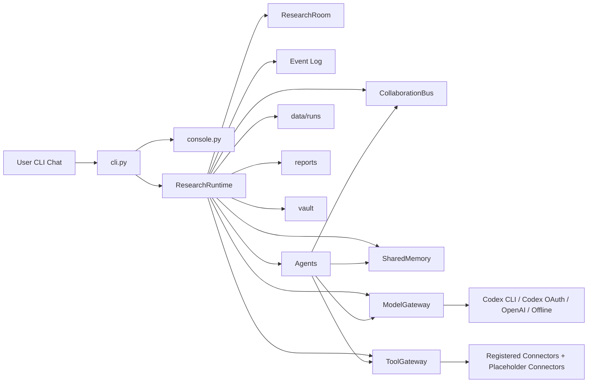

# JIMMORIA Project Structure

이 문서는 JIMMORIA 프로젝트의 전체 구조, 런타임 개념, 에이전트 역할, 데이터 흐름, 저장 위치, 앞으로 붙일 외부 커넥터의 위치를 설명한다.

JIMMORIA는 크립토 가격 매매 도구가 아니라, 리서치 전용 멀티에이전트 회사 CLI다. 사용자는 터미널에서 자연어로 리서치 요청을 입력하고, Supervisor가 Research Room을 열어 여러 전문 에이전트에게 일을 나눈다. 에이전트들은 소스 정리, 내러티브 분석, 초기 프로젝트 후보 발굴, KOL/소셜 체크, 온체인/제품/토큰 체크, 보고서 작성, Obsidian 노트 정리를 수행한다.

현재 버전은 MVP다. 멀티에이전트 협업 구조, 보고서 생성, 런 저장, Obsidian-style 노트 생성은 동작한다. Web Search, URL fetch, Website/Docs crawler, GitHub reader/search, DEX Screener search, CoinGecko search/metadata는 ToolGateway 뒤에 기본 connector로 등록된다. X/Twitter, Telegram, Discord, RootData, Explorer/RPC, funding/airdrop 같은 커넥터는 아직 placeholder 상태다.

## 1. 프로젝트 목표

JIMMORIA의 핵심 목표는 "채팅으로 조종하는 크립토 리서치 회사"를 CLI에서 구현하는 것이다.

사용자가 원하는 주요 작업은 다음과 같다.

- 아티클, 트윗, 링크, PDF, 문서 같은 소스를 넣고 리서치 보고서 생성
- KOL 핸들 목록 수집과 KOL별 언급 프로젝트 추적
- X/Twitter, Telegram, Discord, RSS 등에서 내러티브와 프로젝트 신호 탐지
- 초기에 주목받기 전의 프로젝트 후보 발굴
- Docs, GitHub, 웹사이트, 토큰 상태, 포인트/에어드랍 단서 확인
- 결과를 Markdown 보고서와 Obsidian Vault 형태로 정리
- 나중에 UI에서 에이전트 작업 흐름을 시각적으로 replay할 수 있도록 이벤트 로그 저장

## 2. 최상위 폴더 구조

```text
jimmoria/
  crypto_research_agents/
    cli.py
    console.py
    runtime.py
    agents/
    connectors/
    core/
    storage/

  config/
    agents/
    processes/
    models/
    skills/
    tools/

  templates/
    obsidian/

  docs/
  tests/

  data/
  reports/
  vault/
```

핵심은 `crypto_research_agents/`가 실제 실행 코드이고, `config/`가 회사의 에이전트 정의, Research Room process, 도구/모델 정책을 담는다는 점이다. `connectors/`는 ToolGateway 뒤에 붙는 실제 외부/HTTP 리서치 도구 구현을 담는다. `data/`, `reports/`, `vault/`는 실행하면서 생성되는 로컬 출력 폴더라 Git에는 올리지 않는다.

## 3. 실행 진입점

설치 후 실행 명령은 다음이다.

```powershell
jimmoria
```

이 명령은 `pyproject.toml`의 script entrypoint로 연결된다.

전체 리서치/LLM/콘솔 도구를 한 번에 설치하려면 다음을 사용한다.

```powershell
python -m pip install -e ".[all]"
```

기본 dependency에는 콘솔 테마 렌더링을 위한 `rich`가 포함된다. `.[all]` extra는 `openai`, `httpx`, `beautifulsoup4`, `feedparser`, `ddgs`까지 설치해서 LLM/API/RSS/HTML/Web Search connector 확장에 필요한 도구를 함께 준비한다.

```toml
[project.scripts]
jimmoria = "crypto_research_agents.cli:main"
crypto-research = "crypto_research_agents.cli:main"
```

즉, `jimmoria`를 치면 `crypto_research_agents/cli.py`의 `main()`이 실행된다.

주요 CLI 명령은 다음과 같다.

```text
jimmoria                    대화형 Research HQ 실행
jimmoria hq                 대화형 Research HQ 실행
jimmoria chat               hq와 같은 채팅형 콘솔
jimmoria demo               내장 데모 리서치 실행
jimmoria research           텍스트, 파일, URL 기반 리서치 실행
jimmoria article            research 별칭
jimmoria add-source         소스만 저장하고 Obsidian Source Note 생성
jimmoria doctor             현재 기능 연결 상태 확인
jimmoria runs               이전 실행 목록
jimmoria status <room_id>   특정 Research Room 상태
jimmoria messages <room_id> 에이전트 협업 메시지
jimmoria events <room_id>   UI/replay 이벤트
jimmoria show-report <id>   저장된 보고서 출력
```

## 4. 전체 아키텍처

JIMMORIA는 controlled P2P 구조다. 모든 에이전트가 완전 자유롭게 서로 호출하는 것이 아니라, Supervisor와 Agent Bus, Shared Memory, Tool Gateway를 중심으로 협업한다.



중앙 개념은 다음과 같다.

| 개념 | 파일 | 역할 |
|---|---|---|
| CLI | `crypto_research_agents/cli.py` | 명령어 파싱, 채팅 루프, 모델 설정 패널 |
| Console | `crypto_research_agents/console.py` | JIMMORIA 로고, 박스형 입력창, 도움말, 실시간 에이전트 상황판 출력 |
| Runtime | `crypto_research_agents/runtime.py` | Research Room 생성과 에이전트 실행 순서 관리 |
| ProcessSpec | `core/process_spec.py` + `config/processes/` | Research Room의 goals, task order, expected output, artifact contract 정의 |
| ResearchRoom | `core/room.py` | 하나의 리서치 작업 단위와 상태 |
| CollaborationBus | `core/bus.py` | 에이전트 요청, 응답, 핸드오프, 업데이트 로그 |
| SharedMemory | `core/memory.py` | 소스, 프로젝트 후보, finding, entity graph 저장 |
| ModelGateway | `core/model_gateway.py` | task type에 따라 모델 라우팅 |
| LLM Provider | `core/llm_provider.py` | Codex CLI, Codex OAuth, OpenAI, offline fallback 연결 |
| ToolGateway | `core/tool_gateway.py` | 에이전트별 tool 권한 검사와 audit log |
| Connectors | `connectors/` | Web Search, URL, Website/Docs, GitHub, DEX Screener, CoinGecko connector 등록 |
| Storage | `storage/` | memory, run snapshot, Obsidian note 저장 |
| Path Resolver | `storage/paths.py` | 설치형 CLI가 어디서 실행되든 JIMMORIA 프로젝트의 config/data/reports/vault 경로를 안정적으로 찾음 |

## 5. Research Room 실행 흐름

일반 리서치 요청은 `ResearchRuntime.run_article_research()`로 들어간다.

단, 모든 채팅 입력이 Research Room으로 들어가는 것은 아니다. 사용자가 "보고서 만든 거 보내줘", "전체 보고서 보여줘", "3jane 보고서 만들어봐", `/report 3jane`처럼 기존 산출물을 요청하면 Supervisor가 `report_retrieval`로 분류하고 새 Research Room을 열지 않는다. 이 경우 `data/runs/*/room.json`과 `reports/*.md`에서 기존 보고서를 찾아 출력한다. 새 조사를 원하면 "새로", "리서치", "조사", "분석"처럼 새 Research Room 의도를 명시해야 한다.

또한 Research Room을 여는 요청은 바로 실행하지 않는다. Supervisor가 먼저 입력을 해석해 `Supervisor check`를 보여주고, 사용자가 Enter/Y로 확인해야 `project_research_room` 또는 `source_ingestion_room`이 열린다. 사용자가 `n`을 입력하면 에이전트는 실행되지 않고 run/report 산출물도 만들지 않는다.

실행 순서는 현재 다음과 같다.

```text
1. ResearchRoom 생성
2. room_created 이벤트 기록
3. supervisor_agent 실행
4. ingestion_agent 실행
5. narrative_agent 실행
6. discovery_agent 실행
7. social_kol_agent 실행
8. contract_onchain_agent 실행
9. product_tech_agent 실행
10. funding_token_agent 실행
11. report_agent 실행
12. obsidian_curator_agent 실행
13. room_completed 이벤트 기록
14. memory.json, run snapshot, report, vault note 저장
```

상태는 `RuntimeState` 값으로 이동한다.

```text
created
assigned
running
waiting_for_tool
ready_for_report
writing_report
obsidian_syncing
completed
```

현재는 순차 실행에 가깝지만, 구조상 각 에이전트의 요청/응답은 `CollaborationBus`에 기록된다. 나중에 병렬 실행, 비동기 큐, UI replay를 붙일 때 이 bus와 event log가 기반이 된다.

CLI는 `room_created`, `agent_start`, `agent_done`, `agent_failed`, `room_completed` 이벤트를 받아 보라/핑크 테마의 로그를 출력한다. `room_created`와 `room_completed`에는 전체 `Live agent board`를 보여주고, 각 `agent_start`/`agent_done` 이벤트는 짧은 작업 카드로 출력해서 로그가 과도하게 반복되지 않게 한다. 사용자가 작업 지시를 넣으면 각 에이전트가 `WAIT`, `RUN`, `DONE`, `FAIL` 중 어떤 상태인지와 현재 무엇을 하는지 바로 볼 수 있다.

채팅 입력 UX는 "고정 입력창 + 위쪽 로그"에 가깝게 유지한다. 사용자가 입력을 제출하면 ANSI 터미널에서는 제출된 입력 박스를 지우고, 입력 내용은 큰 `You` 패널이 아니라 `You > ...` 한 줄 로그로 위에 남긴다. 그 다음 `Supervisor > ...` 진행 로그가 나오고, Supervisor 답변 또는 Research Room 이벤트가 이어진다. 입력 박스는 `JIMMORIA HQ` dock처럼 동작하며, `Supervisor channel`, 현재 provider, 최신 room, agent 상태 요약을 함께 보여준다.

CLI/UI 개선 방향은 [jimmoria-cli-ui-reference-notes.md](jimmoria-cli-ui-reference-notes.md)에 따로 정리한다. 이 문서는 Mato, Conduit, Spettro, MetaGPT, ChatDev, ZeroHuman 계열의 terminal workspace, visible orchestration, manifest/runbook 패턴을 JIMMORIA식으로 해석한 기준 문서다.

예시:

```text
Room > OPEN room_abc123 | agents 10 | pearl 프로젝트 리서치
Board > 10 wait/0 done
Agent > RUN supervisor_agent | Planning direction
Agent > DONE supervisor_agent | Research room initialized | msg 1 / findings 1
Tool > RUN discovery_agent -> web_search | pearl crypto project
Output > Report written | reports/pearl-room_abc123.md
```

## 6. 에이전트 구성

현재 실제 런타임에서 기본 실행되는 에이전트는 `runtime.py`의 `DEFAULT_AGENTS`에 정의된 10개다.

CLI 시작 도움말에는 정적 에이전트 목록을 길게 보여주지 않는다. 대신 사용자가 작업을 입력해 Research Room이 열리면 `Live agent board`와 짧은 agent work cards로 에이전트별 현재 작업 상태가 표시된다. 전체 agent roster와 planned agent까지 보고 싶을 때는 `/company`를 사용한다.

| Agent ID | 구현 클래스 | 역할 | 현재 동작 |
|---|---|---|---|
| `supervisor_agent` | `SupervisorAgent` | 목표와 실행 방향 설정 | Research Room 목표, 참여 에이전트, 모델 선택 정보를 finding으로 기록 |
| `ingestion_agent` | `IngestionAgent` | 소스 저장과 메타데이터 추출 | 입력 소스를 `SharedMemory.sources`에 저장하고 summary/entities/keywords 추출 |
| `narrative_agent` | `NarrativeAgent` | 내러티브 분류 | AI wallet, Consumer Crypto, DeFi Automation 등 taxonomy 기반 narrative 분류 |
| `discovery_agent` | `DiscoveryAgent` | 초기 프로젝트 후보 발굴 | 프로젝트명 기반 요청이면 `web_search`, GitHub, CoinGecko, DEX Screener로 후보를 resolve하고, 일반 내러티브 요청이면 fallback 후보를 생성 |
| `social_kol_agent` | `SocialKOLAgent` | KOL/소셜 신호 확인 | X API는 아직 placeholder지만, web search와 공식 링크에서 social/community URL을 우선 추출 |
| `contract_onchain_agent` | `ContractOnchainAgent` | 체인, 토큰, 컨트랙트 확인 | Explorer/RPC는 아직 placeholder지만 CoinGecko/DEX Screener 결과를 token/market evidence로 반영 |
| `product_tech_agent` | `ProductTechAgent` | Docs, GitHub, 제품 상태 확인 | 등록된 `crawl_website`/`crawl_docs` connector로 URL이 있는 후보의 제품 상태와 공식 링크를 확인 |
| `funding_token_agent` | `FundingTokenAgent` | 투자자, 포인트, 토큰 기회 확인 | RootData/funding connector는 아직 placeholder지만 검색/웹/문서 evidence에서 points, airdrop, mining, ticker 힌트를 추출 |
| `report_agent` | `ReportAgent` | 보고서 작성 | findings와 candidates를 Markdown dossier로 합성하고 Evidence Map에 웹사이트, GitHub, market, search URL을 정리 |
| `obsidian_curator_agent` | `ObsidianCuratorAgent` | Obsidian-style 노트 정리 | Source, Project, Narrative, Report 노트 작성 |

`config/agents/`에는 기본 실행되지 않는 추가 설계용 agent spec도 있다.

| Agent Spec | 상태 | 목적 |
|---|---|---|
| `monitor_24h_agent.yaml` | planned | 24시간 RSS, X, Telegram, GitHub, docs 변화 감지 |
| `memory_retrieval_agent.yaml` | planned | 과거 실행, entity graph, vector memory 검색 |
| `tool_policy_agent.yaml` | planned | tool 권한, secret scan, safety policy 관리 |

이 agent spec들은 아직 `DEFAULT_AGENTS`에 들어가 있지 않지만, 회사 구조 확장 시 추가될 수 있다.

## 7. AgentSpec와 persona YAML

`config/agents/*.yaml`은 각 에이전트의 persona, 역할, 금지사항, tool allowlist, memory 접근 범위, output schema를 정의한다.

이 파일들은 `core/agent_spec.py`의 `AgentSpecRegistry.load_dir()`로 로드된다.

AgentSpec이 담는 주요 필드는 다음이다.

```text
agent_id
name
persona_name
identity
personality
mission
scope
model_policy
memory_scope
tools.allow
tools.deny
hooks
output_schema
collaboration
must_follow
must_not
```

에이전트는 실행 중 `self.system_prompt()`를 통해 이 YAML 내용을 LLM system prompt로 변환한다. 그래서 코드는 에이전트의 행동 골격을 담당하고, YAML은 그 에이전트가 어떤 회사원처럼 행동해야 하는지를 정의한다.

## 7A. ProcessSpec와 Research Room Tasks

JIMMORIA는 ChatDev의 configurable workflow/phase/role 구조와 crewAI의 `agents.yaml` + `tasks.yaml` + sequential process 패턴을 참고해 `config/processes/` 레이어를 추가했다. 목적은 에이전트 내부 구현을 바꾸지 않고 Research Room의 운영 절차를 config로 분리하는 것이다.

현재 process manifest는 두 개다.

```text
config/processes/project_research_room.yaml
config/processes/source_ingestion_room.yaml
```

`core/process_spec.py`는 다음 구조를 로드한다.

```text
process_id
name
process_type
supervisor_mode
goals
tasks[]
  task_id
  agent_id
  phase
  description
  expected_output
  requires
  output_channels
artifact_contracts
ui
memory_policy
```

`ResearchRuntime`은 process manifest에서 room goals와 agent order를 가져온다. 실제 agent class와 controlled P2P bus는 그대로 유지된다. 즉, crewAI처럼 task를 config로 선언하지만 JIMMORIA의 Supervisor, CollaborationBus, SharedMemory, ToolGateway 구조는 그대로 남는다.

`room_created` event에는 process metadata가 함께 저장된다.

```json
{
  "type": "room_created",
  "process": {
    "process_id": "project_research_room",
    "process_type": "sequential_controlled_p2p",
    "tasks": []
  }
}
```

이 process metadata는 나중에 웹 visualizer가 agent workflow를 replay할 때 phase/task label로 사용할 수 있다.

## 8. Collaboration Bus

`core/bus.py`의 `CollaborationBus`는 append-only 협업 기록이다.

메시지 타입은 크게 다음과 같다.

```text
REQUEST   한 에이전트가 다른 에이전트에게 작업 요청
RESPONSE  요청에 대한 결과 반환
HANDOFF   다음 에이전트에게 컨텍스트 넘김
UPDATE    전체 혹은 특정 대상에게 상태 공유
```

예를 들어 `discovery_agent`는 후보 프로젝트를 만든 뒤 다음 에이전트들에게 요청을 보낸다.

```text
discovery_agent -> social_kol_agent
discovery_agent -> contract_onchain_agent
discovery_agent -> product_tech_agent
discovery_agent -> funding_token_agent
```

이 기록은 실행 후 `data/runs/<room_id>/messages.json`에 저장된다. 나중에 CLI나 웹 UI에서 "누가 누구에게 무엇을 요청했는지" 보여줄 때 핵심 데이터가 된다.

## 9. Shared Memory

`core/memory.py`의 `SharedMemory`는 회사의 공통 기억이다.

현재 저장하는 데이터는 다음이다.

| 데이터 | 클래스 | 설명 |
|---|---|---|
| Source | `SourceRecord` | 사용자가 넣은 아티클, 링크, 텍스트, 원문과 메타데이터 |
| Project | `ProjectCandidate` | discovery 단계에서 만들어진 후보 프로젝트 |
| Finding | `FindingRecord` | 각 에이전트가 남긴 조사 결과 |
| Entity Graph | `dict[str, set[str]]` | 프로젝트와 narrative 등 엔티티 관계 |

`SourceRecord`에는 `content_hash`, `canonical_url`, `captured_at`, `raw_path`, `source_quality_score`가 포함된다. 같은 canonical URL이나 같은 content hash가 다시 들어오면 `SharedMemory.add_source()`가 기존 SourceRecord를 재사용해서 중복 ingestion을 줄인다.

실행 중에는 메모리 객체로 존재하고, 실행 후 `storage/json_store.py`를 통해 `data/memory.json`에 저장된다.

현재는 간단한 JSON 메모리다. 나중에 붙일 수 있는 확장 방향은 다음이다.

- SQLite/Postgres 기반 project DB
- vector DB 기반 source retrieval
- KOL profile DB
- entity graph persistence
- run 간 중복 프로젝트 dedupe

## 10. Model Gateway와 LLM Provider

모델 호출은 에이전트가 직접 모델을 고르는 방식이 아니라 `ModelGateway`를 통한다.

`core/model_gateway.py`는 `task_type`에 따라 모델 route를 선택한다.

| Task Type | Route |
|---|---|
| `source_ingestion` | fast/default model |
| `narrative_reasoning` | reasoning model |
| `supervision` | reasoning model |
| `report_writing` | writing model |
| `final_synthesis` | writing model |
| `embedding_search` | embedding model |

실제 provider는 `core/llm_provider.py`에서 결정된다.

| Provider | 조건 | 설명 |
|---|---|---|
| `codex_cli` | `LLM_PROVIDER=codex_cli` | 로컬 Codex CLI 로그인 세션으로 `codex exec` 호출 |
| `codex_oauth` | `CODEX_OAUTH_TOKEN` 등 명시적 token source | OpenAI-compatible endpoint에 bearer token으로 요청 |
| `openai` | `OPENAI_API_KEY` | OpenAI Python SDK 사용 |
| `offline_fallback` | 설정 없음 | deterministic local fallback, 테스트와 MVP 안전장치 |

`codex_cli` provider는 `codex exec --help`를 읽고 현재 설치된 Codex CLI가 지원하는 옵션만 붙인다. 예를 들어 어떤 버전은 `--ask-for-approval`을 지원하지 않으므로, JIMMORIA는 이 옵션을 하드코딩하지 않는다. 현재 provider는 지원 여부를 확인한 뒤 `--ephemeral`, `--skip-git-repo-check`, `--sandbox`, `--output-last-message`, `--model` 같은 옵션을 선택적으로 사용한다. 또한 한국어 리서치 요청이 Windows 코드페이지를 타며 깨지지 않도록 `codex exec -` stdin에는 프롬프트를 UTF-8 bytes로 직접 전달한다. 이 방식은 Codex CLI 버전 차이와 터미널 인코딩 차이 때문에 리서치 런이 중간에 죽는 일을 줄이기 위한 호환성 장치다.

CLI에서 `/models`를 실행하면 모델/provider 설정 화면이 나온다. 설정은 `data/model_settings.json`에 저장된다. 토큰 자체는 저장하지 않고 provider/model preference만 저장한다.

## 11. Tool Gateway와 외부 커넥터

`core/tool_gateway.py`의 `ToolGateway`는 에이전트가 외부 도구를 직접 만지지 않도록 막는 중간 계층이다.

역할은 세 가지다.

```text
1. 에이전트별 tool 권한 검사
2. 실제 tool connector 호출
3. tool audit log 기록
```

`connectors/register_default_connectors()`는 런타임 시작 시 기본 connector를 ToolGateway에 붙인다.

```text
web_search
fetch_url
parse_html
archive_source_snapshot
crawl_website
crawl_docs
github_search_repos
read_github_repo
dexscreener_search_pairs
coingecko_coin_metadata
```

이제 이 tool들은 `unconfigured`가 아니라 실제 connector result를 반환한다. 검색어나 URL이 부족한 경우에는 `missing_input`, 외부 요청이 실패한 경우에는 `failed`, 정상 동작 시에는 `success`로 audit log에 기록된다.

아직 연결되지 않은 외부 tool을 에이전트가 호출하면 다음 같은 결과가 저장된다.

```json
{
  "status": "unconfigured",
  "tool": "x_search_posts",
  "message": "Tool connector is not configured in MVP runtime.",
  "data": null
}
```

이 로그는 `data/runs/<room_id>/tool_audit_log.json`에 저장된다.

필요한 tool 목록과 우선순위는 `config/tools/tool_registry.yaml`에 정리되어 있다. 구현된 connector는 `implementation_status: implemented`로 표시된다.

중요한 live stack은 다음이다. 이 중 Web Search/URL/Website/Docs/GitHub/DEX Screener/CoinGecko 계열은 초안 connector가 구현되어 있고, X/RootData/Explorer/vector 계열은 아직 다음 단계다.

```text
x_search_posts
x_get_user_timeline
x_build_kol_list
rss_monitor_feed
web_search
crawl_website
crawl_docs
github_search_repos
read_github_repo
coingecko_coin_metadata
dexscreener_search_pairs
explorer_lookup
rootdata_search_projects
source_cache_write
vector_search
vector_upsert
render_markdown
write_note
```

## 12. Storage와 출력 파일

JIMMORIA는 실행 결과를 여러 형태로 저장한다.

| 경로 | 설명 |
|---|---|
| `data/memory.json` | 전체 SharedMemory 저장 |
| `data/model_settings.json` | provider/model preference 저장 |
| `data/runs/<room_id>/room.json` | ResearchRoom 상태 저장 |
| `data/runs/<room_id>/messages.json` | CollaborationBus 메시지 저장 |
| `data/runs/<room_id>/tool_audit_log.json` | ToolGateway 호출 기록 |
| `data/runs/<room_id>/llm_call_log.json` | ModelGateway 호출 기록 |
| `data/runs/<room_id>/events.json` | CLI/UI replay용 이벤트 로그 |
| `reports/*.md` | ReportAgent가 작성한 Markdown 보고서 |
| `vault/10_Projects/*.md` | Obsidian project note |
| `vault/20_Sources/*.md` | Obsidian source note |
| `vault/30_Narratives/*.md` | Obsidian narrative note |
| `vault/50_Reports/*.md` | Obsidian report note |

특히 `events.json`은 나중에 시각화 UI를 만들 때 중요하다. 현재 CLI에서는 이벤트를 실시간으로 받아 에이전트 진행 상태를 출력하고, 나중에 웹 화면에서는 이 이벤트 스트림을 replay해서 "어떤 에이전트가 언제 시작했고 언제 끝났는지" 보여줄 수 있다.

## 13. Obsidian Vault 구조

`storage/obsidian_store.py`는 local filesystem 기반 Obsidian-style Vault를 만든다.

```text
vault/
  10_Projects/
  20_Sources/
  30_Narratives/
  50_Reports/
```

각 note는 frontmatter를 포함한다.

Project note 예시 필드:

```yaml
type: project
project_id: proj_xxxxx
project_name: Example
chain: unknown
narrative:
  - AI x Wallet Automation
token_status: unknown
early_radar_score: 65
created_at: ...
```

Source note에는 source_id, source_type, title, url, extracted metadata, content가 들어간다. Report note에는 최종 Markdown dossier가 들어간다.

## 14. 현재 동작하는 리서치 시나리오

### Case 1. 사용자가 아티클이나 리서치 질문을 입력

```text
User input
  -> CLI
  -> ResearchRuntime.run_article_research
  -> Ingestion
  -> Narrative
  -> Discovery
  -> Social / Contract / Product / Funding checks
  -> Report
  -> Obsidian sync
```

이 경우 핵심은 다음이다.

```text
아티클/질문/URL -> 기억화 + source hash/snapshot -> 내러티브 추출 -> 프로젝트명 요청이면 web/GitHub/market search로 후보 resolve -> website/docs/GitHub connector 확인 -> 나머지 미연결 검증은 placeholder -> Evidence Map 포함 보고서
```

### Case 2. 24시간 모니터가 신호를 발견

아직 런타임에 연결되지 않았지만 설계상 흐름은 다음이다.

```text
monitor_24h_agent
  -> signal queue
  -> supervisor_agent
  -> discovery_agent
  -> 검증 에이전트들
  -> daily radar report
  -> Obsidian watchlist
```

이를 위해 `monitor_24h_agent.yaml`과 tool registry의 `monitor_*`, `rss_monitor_feed`, `push_signal_queue` 계열 도구가 준비되어 있다.

## 15. 코드 파일별 설명

### `crypto_research_agents/cli.py`

CLI entrypoint다. 명령어 파싱, interactive chat loop, `/models`, `/doctor`, `/runs`, `/report` 같은 명령 처리, 모델 설정 저장을 담당한다.

중요 함수:

```text
main()
chat_command()
handle_chat_command()
configure_model_panel()
configure_codex_oauth()
configure_model_routes()
doctor_command()
find_saved_report_for_request()
```

### `crypto_research_agents/console.py`

터미널 UI를 담당한다. 시작 로고, 보라/핑크 3D 느낌의 JIMMORIA 배너, `JIMMORIA HQ` 상태 입력 dock, 제출된 입력 박스 제거, `You > ...`/`Supervisor > ...` 대화 로그, `/help` 명령어 목록, `rich` 기반 Panel/Table 로그, `Live agent board`, agent work cards, 보고서 preview를 담당한다. `JIMMORIA_PLAIN_LOGS=1`을 설정하면 rich 테마 로그 대신 plain text fallback을 사용할 수 있다.

중요 함수:

```text
JimmoriaConsole.print_intro()
JimmoriaConsole.read_chat_input()
JimmoriaConsole.handle_event()
print_jimmoria_logo()
jimmoria_3d_logo_layers()
```

### `crypto_research_agents/runtime.py`

회사 운영 엔진이다. ResearchRoom을 만들고 정해진 순서대로 에이전트를 실행한다. 각 에이전트 시작/완료 이벤트를 만들고, 실행 후 memory와 run snapshot을 저장한다.

중요 함수:

```text
ResearchRuntime.run_article_research()
ResearchRuntime.run_source_ingestion()
ResearchRuntime._run_agent()
ResearchRuntime._emit()
default_policy()
```

### `crypto_research_agents/agents/`

각 전문 에이전트 구현이 들어 있다.

```text
base.py
supervisor.py
ingestion.py
narrative.py
discovery.py
social_kol.py
contract_onchain.py
product_tech.py
funding_token.py
report.py
obsidian_curator.py
```

### `crypto_research_agents/connectors/`

ToolGateway 뒤에 붙는 실제 connector 구현이다.

```text
__init__.py              register_default_connectors(tool_gateway)
base.py                  normalized success/missing_input/failed result helper
url_fetcher.py           fetch_url, parse_html, crawl_website, crawl_docs, source snapshot
web_search.py            DDGS 기반 public web_search connector
github_connector.py      github_search_repos, read_github_repo
market_connectors.py     dexscreener_search_pairs, coingecko_coin_metadata
```

현재 connector는 비용이 낮고 API key가 거의 필요 없는 public HTTP 기반으로 시작한다. Web Search는 `ddgs`를 사용한다. GitHub는 `GITHUB_TOKEN`이 있으면 사용하지만 없어도 public API로 동작한다. DEX Screener와 CoinGecko도 public endpoint를 먼저 사용한다.

### `crypto_research_agents/core/`

런타임의 공통 도메인 객체가 들어 있다.

```text
agent_spec.py       YAML persona/spec loader
process_spec.py     Research Room process/task manifest loader
bus.py              CollaborationBus
message.py          AgentMessage model
memory.py           SharedMemory, SourceRecord, ProjectCandidate, FindingRecord, source dedupe
model_gateway.py    model route selector
llm_provider.py     Codex/OpenAI/offline provider
room.py             ResearchRoom
runtime_state.py    room status enum
tool_gateway.py     tool policy, calls, audit log
tool_call.py        tool call record
hooks.py            before/after hook engine
capabilities.py     doctor command capability check
```

### `crypto_research_agents/storage/`

파일 저장 담당이다.

```text
json_store.py       data/memory.json load/save
run_store.py        data/runs/<room_id> snapshot save/load
obsidian_store.py   vault note writer
paths.py            safe filename helper
```

`paths.py`는 단순 filename helper에서 프로젝트 경로 resolver 역할까지 확장되었다. 기본 `config/agents`, `config/processes`, `data/memory.json`, `data/model_settings.json`, `reports`, `vault`는 현재 터미널 위치가 아니라 JIMMORIA 프로젝트 루트를 기준으로 해석된다. 그래서 `C:\Users\...`에서 `jimmoria`를 실행해도 `C:\jimmoria\config\processes`와 기존 run/report를 찾을 수 있다.

## 16. Config 파일별 설명

### `config/agents/`

에이전트별 persona와 policy다. 코드에서 각 에이전트의 기능 골격을 정의하고, config에서는 그 에이전트가 어떤 관점과 제약으로 일해야 하는지 정의한다.

### `config/processes/`

Research Room의 process/task manifest다. ChatDev처럼 workflow/phase/role을 설정으로 관리하고, crewAI처럼 agent와 task를 분리한다. 현재 `project_research_room.yaml`은 full research dossier를 위한 10-agent process이고, `source_ingestion_room.yaml`은 source-only ingestion을 위한 3-agent process다. Runtime은 이 manifest에서 goals와 agent order를 읽고, `room_created.process` event에 process metadata를 저장한다.

### `config/models/model_router.yaml`

모델 route와 환경변수 기준이다. 실제 코드의 `ModelGateway`와 CLI model setup이 이 개념을 따른다.

### `config/tools/tool_registry.yaml`

필요하거나 사용하면 좋은 외부 tool 전체 목록이다. 각 tool의 owner agent, priority, implementation status, required secrets, source docs를 담는다.

### `config/skills/`

리서치 workflow 정의다.

```text
article_ingestion.yaml
project_research.yaml
```

현재는 문서/설계 성격이 강하고, 앞으로 runtime이 skill definition을 더 직접 사용하도록 확장할 수 있다.

## 17. 테스트 구조

테스트는 `tests/test_smoke.py`에 모여 있다.

현재 테스트하는 범위는 다음이다.

```text
- JIMMORIA CLI banner
- pyproject script entrypoint
- article research loop output
- agent specs load
- CLI research/events command
- Codex OAuth/Codex CLI/OpenAI/offline provider selection
- Codex CLI exec flag compatibility
- Codex CLI UTF-8 stdin handling for Korean prompts
- model setup flow
- startup model setup skip
- doctor capability status
- tool registry required stack
- tool audit log
- default connector registration
- web search connector registration
- Pearl-style project name discovery candidate resolution
- URL/HTML connector metadata extraction
- SourceRecord content hash/canonical URL dedupe
- boxed chat input prompt
- rich themed runtime log panels
- compact agent work cards
- live agent board current-work display
- purple/pink 3D logo palette
```

실행:

```powershell
python -m unittest discover -s tests -v
```

## 18. 현재 한계

현재 MVP는 리서치 회사의 뼈대와 협업 흐름에 더해, 저비용 HTTP connector 일부가 붙은 단계다.

구체적인 한계는 다음과 같다.

- X/Twitter API가 아직 연결되지 않았다.
- Telegram/Discord reader가 아직 연결되지 않았다.
- Web Search/URL/Website/Docs/GitHub/DEX Screener/CoinGecko는 초안 connector가 등록되어 있지만, 검색 품질은 DDGS/provider 가용성에 영향을 받고, Playwright fallback, sitemap adapter, GitHub commit/release 상세 분석은 아직 약하다.
- Explorer/RPC/RootData connector가 아직 등록되지 않았다.
- DiscoveryAgent는 프로젝트명 기반 요청에서 web/GitHub/CoinGecko/DEX search로 live candidate를 만들 수 있다. 다만 general narrative discovery는 아직 placeholder 후보 생성이 남아 있다.
- Social/Contract/Funding 에이전트의 일부 핵심 live tool은 여전히 `unconfigured` audit log를 남긴다. 대신 Social은 web/social URL을 추출하고, Contract는 CoinGecko/DEX Screener를 반영하며, Funding은 evidence text에서 token/points/mining 힌트를 추출한다.
- Vector DB와 entity graph persistence는 아직 간단한 JSON memory 수준이다.

즉, 지금은 "회사 운영 시스템"에 첫 번째 실제 리서치 도구 묶음이 붙은 상태다. 다음은 이 도구 결과를 Identity/Evidence/Collision 검증 엔진으로 엮어 보고서 신뢰도를 올리는 단계다.

## 19. 다음 개발 순서 제안

현재 구조 기준으로 다음 순서가 자연스럽다.

```text
1. Project Research Loop 추가: `jimmoria project --url/--ca/--x`
2. Identity Resolver + Ticker Collision Engine 추가
3. Evidence Validator / Citation Checker 추가
4. GitHub connector를 commits/releases/activity까지 확장
5. Web Search 결과를 source snapshot과 citation checker에 연결
6. RSS monitor + Signal Queue로 24H Radar 입력원 구축
7. X/KOL search와 local KOL DB 구현
8. RootData/Explorer/RPC connector 구현
9. SharedMemory를 SQLite/vector DB로 확장
10. events.json 기반 CLI replay 또는 web visualizer 구현
```

## 20. 문서 업데이트 원칙

이 문서는 JIMMORIA의 기준 설계 문서다. 앞으로 코드, 설정, 에이전트 구성, tool registry, 모델 라우팅, 저장 구조, CLI UX, 출력 폴더, live connector 상태가 바뀌면 이 문서도 함께 업데이트한다.

변경할 때 확인해야 할 항목은 다음이다.

- 새 에이전트를 추가하거나 제거하면 `6. 에이전트 구성`을 업데이트한다.
- 실행 순서나 Research Room 상태가 바뀌면 `5. Research Room 실행 흐름`을 업데이트한다.
- CLI 명령이나 시작 UX가 바뀌면 `3. 실행 진입점`, `15. 코드 파일별 설명`을 업데이트한다.
- CLI/UI 레퍼런스나 terminal interaction 기준이 바뀌면 `jimmoria-cli-ui-reference-notes.md`도 업데이트한다.
- 모델 provider, Codex OAuth, OpenAI, offline fallback 흐름이 바뀌면 `10. Model Gateway와 LLM Provider`를 업데이트한다.
- 외부 tool이나 connector를 추가하면 `11. Tool Gateway와 외부 커넥터`, `18. 현재 한계`, `19. 다음 개발 순서 제안`을 업데이트한다.
- 저장 파일, run snapshot, Obsidian Vault 구조가 바뀌면 `12. Storage와 출력 파일`, `13. Obsidian Vault 구조`를 업데이트한다.
- 테스트 범위가 늘어나면 `17. 테스트 구조`를 업데이트한다.
- README의 간단 설명과 이 문서의 상세 설명이 서로 어긋나지 않게 확인한다.

즉, JIMMORIA를 업데이트할 때는 코드만 고치는 것이 아니라 이 문서도 같이 최신 상태로 유지한다.

## 21. 한 줄 요약

JIMMORIA는 현재 "채팅형 CLI + ProcessSpec 기반 Research Room + controlled P2P Agent Bus + Shared Memory + Model Gateway + Tool Gateway + 기본 Web Search/URL/Website/Docs/GitHub/DEX/CoinGecko connectors + Markdown/Obsidian output"까지 구현된 크립토 리서치 회사 MVP다. 다음 핵심 작업은 Project Research Loop, Identity/Evidence/Collision 검증 엔진, 그리고 Social/Contract/Funding 에이전트의 source-backed finding 업그레이드다.
## 22. Current Runtime Update Notes

최근 변경 기준으로 JIMMORIA는 live/source-backed 후보와 MVP placeholder 후보를 구분한다.

| Field | Value | Meaning |
|---|---|---|
| `candidate_origin` | `live_source_backed` | 웹/GitHub/market connector 증거가 붙은 후보 |
| `candidate_origin` | `mvp_placeholder` | 내러티브만 보고 생성한 MVP용 계획 후보 |
| `candidate_origin` | `manual_input` | 사용자가 직접 넣은 후보 |
| `source_backing` | `web_github_market_search` | web search, GitHub, CoinGecko, DEX Screener 계열 evidence |
| `source_backing` | `narrative_seed_only` | 외부 live evidence 없이 narrative seed만 사용 |

ReportAgent는 Candidate Projects 표에 `Origin`과 `Source Backing` 열을 표시한다. `mvp_placeholder` 후보는 `[MVP Placeholder]` 라벨을 붙이고, TL;DR/Open Questions에서 live 후보가 아님을 명시한다. Obsidian project note도 frontmatter와 본문에 `candidate_origin`, `source_backing`을 저장한다.

CLI live board는 긴 roster를 반복 출력하지 않고 짧은 activity label을 사용한다.

| Agent ID | Current Work Label |
|---|---|
| `supervisor_agent` | Planning direction |
| `ingestion_agent` | Extracting source metadata |
| `narrative_agent` | Mapping narratives |
| `discovery_agent` | Resolving candidates |
| `social_kol_agent` | Checking social signal |
| `contract_onchain_agent` | Checking token identity |
| `product_tech_agent` | Checking docs/GitHub |
| `funding_token_agent` | Checking funding/token hints |
| `report_agent` | Writing dossier |
| `obsidian_curator_agent` | Syncing vault notes |

`/board`는 현재 Research Room의 live agent board를 다시 보여준다. `/messages`와 `jimmoria messages <room_id>`는 `task.summary`, `task.objective`, `result.summary`, `result.status`, message-level `status`, `notes` 순서로 요약을 찾아 `None` 대신 사람이 읽을 수 있는 내용을 표시한다.

ToolGateway는 tool 호출을 event stream에도 기록한다.

```text
tool_start
tool_done
tool_failed
tool_denied
tool_unconfigured
```

Runtime은 주요 산출물도 event로 남긴다.

```text
finding_saved
source_saved
report_written
note_written
room_failed
```

따라서 `data/runs/<room_id>/events.json`은 나중에 웹/비주얼 replay 화면에서 에이전트 실행, tool 호출, 보고서/노트 저장 흐름을 그대로 재생하는 기반이 된다.

Report runtime metadata에는 `LLM provider`와 `Report model route`가 들어간다. provider가 `offline_fallback`이면 TL;DR에 `Live LLM: not configured`가 표시되어 deterministic fallback을 실제 LLM 판단처럼 오해하지 않게 한다.
## 23. Supervisor Intake And Company Settings

JIMMORIA는 이제 모든 일반 채팅 입력을 바로 보고서 생성으로 처리하지 않는다. 사용자는 기본적으로 Supervisor와 대화하고, Supervisor는 회사 사장/총괄 PM처럼 intent와 output mode를 내부적으로 분류한다. 화면에는 기계적인 분류 카드보다 Supervisor의 대화 응답이 먼저 나온다.

| Input Type | 처리 방식 |
|---|---|
| 리서치/분석/보고서 요청 | Research Room을 열고 에이전트에게 배정 |
| 설정/운영/UX/역할 변경 지시 | Research Room을 열지 않고 company settings에 반영 |
| 확인 질문/운영 대화 | Research Room을 열지 않고 Supervisor가 직접 답변 |
| 인사/잡담/애매한 입력 | Research Room을 열지 않고 Supervisor가 방향을 확인 |
| 상태/설정 확인 요청 | Research Room을 열지 않고 settings/status panel 출력 |
| source-only ingestion 요청 | 작은 ingestion room을 열고 Source Note만 저장 |
| 기존 보고서 요청 | 저장된 run/report를 먼저 찾고 Research Room을 열지 않음 |
| URL 입력 | 기본적으로 research flow로 라우팅하되 source-only 표현이 있으면 ingestion만 실행 |

예시:

```text
pearl 프로젝트 리서치 보고서 만들어봐
-> research_request
-> Research Room opened

3jane 보고서 만들어봐
-> report_retrieval
-> saved report lookup
-> Research Room not opened

3jane 새로 리서치 보고서 만들어봐
-> research_request
-> Research Room opened

보고서는 한글로 만들어봐 영어단어는 사용해도 좋아
-> company_config
-> data/company_settings.json 업데이트
-> Research Room not opened

슈퍼바이저는 회사 사장 느낌으로 외주를 받는 역할로 가져가자
-> company_config
-> supervisor_mode = company_ceo
-> client_relationship = outsourcing_client

지금 보고서 작성은 한글 위주로 세팅된게 맞지?
-> supervisor_chat
-> Supervisor reply
-> Research Room not opened

안녕
-> supervisor_chat
-> Supervisor reply
-> company_settings.json에 저장하지 않음
```

설정 파일:

```text
data/company_settings.json
```

주요 필드:

```text
report_language
allow_english_terms
auto_apply_company_instructions
supervisor_mode
client_relationship
supervisor_authority
intake_policy
operating_principles
raw_instructions
```

현재 지원하는 대표 설정:

| Setting | Meaning |
|---|---|
| `report_language: ko` | 보고서 기본 섹션과 핵심 라벨을 한국어로 작성 |
| `allow_english_terms: true` | crypto/technical term은 영어 그대로 허용 |
| `supervisor_mode: company_ceo` | Supervisor를 회사 사장/총괄 PM처럼 동작시킴 |
| `client_relationship: outsourcing_client` | 사용자를 외주를 주는 클라이언트로 취급 |
| `supervisor_authority` | Supervisor가 가진 라우팅, 설정 반영, agent 배정, quality gate 권한 |
| `intake_policy` | 입력 유형별 출력 모드와 실행 방식 |

CLI 명령:

```text
/settings
```

이 명령은 현재 company settings를 출력한다.

Supervisor Intake 결정 객체:

```text
SupervisorIntakeDecision
  intent_type
  action
  output_mode
  needs_research_room
  confidence
  rationale
  next_step
  supervisor_authority
```

Runtime 연결:

- `chat_command()`는 먼저 `decide_supervisor_intake()`로 Supervisor Intake 결정을 만든다.
- CLI는 일반 채팅에서 `Supervisor` 대화 응답을 먼저 출력한다.
- 입력창에 제출한 문장은 별도 `You` 박스로 반복하지 않고 `You > ...` 로그로만 남긴다.
- Supervisor는 답변 전 `Supervisor > ...` 진행 로그를 남겨 지금 메시지를 읽고 라우팅 중이라는 느낌을 준다.
- intent/action/output mode는 내부 `SupervisorIntakeDecision`으로 유지되어 Research Room이 열릴 때 기록된다.
- `company_config`면 `apply_company_instruction()`으로 설정을 저장하고 종료한다.
- `supervisor_chat`이면 `Supervisor reply`로 바로 답하고 종료한다.
- 인사와 애매한 입력은 `company_config`로 저장하지 않고 `supervisor_chat`으로 처리한다.
- `company_status`면 `/settings`와 같은 settings/status panel을 보여주고 종료한다.
- `report_retrieval`이면 `find_saved_report_for_request()`로 기존 run/report를 찾고, 없으면 Research Room을 열지 않은 채 "저장된 보고서를 찾지 못했다"고 답한다.
- `source_ingestion`이면 작은 ingestion room을 열어 Source Note만 저장한다.
- `research_request`면 기존처럼 `ResearchRuntime.run_article_research()`를 실행한다.
- `supervisor_chat` 응답은 `supervisor_chat` 모델 라우트를 사용한다. live LLM이 있으면 자연어 응답을 생성하고, offline fallback이면 로컬 대화 응답을 사용한다.
- `ResearchRuntime`은 `company_settings.json`과 `intake_decision`을 SupervisorAgent와 ReportAgent에 전달한다.
- SupervisorAgent는 `supervision_plan` finding에 `intake_decision`을 저장해 왜 해당 Research Room이 열렸는지 남긴다.
- ReportAgent는 `report_language`를 보고 한국어/영문 report shell을 선택한다.

## 24. Runtime Event Stream

JIMMORIA CLI의 기본 runtime 이벤트 출력은 compact stream이다. 이 방식은 Goose의 local session/tool logs, Agent Cockpit의 mission event stream, Conduit/Mato 계열의 terminal workspace 패턴을 참고했다. 큰 panel/card가 계속 쌓이면 사용자가 실제 진행 상황을 훑기 어렵기 때문에, 기본 화면에서는 아래 형식의 한 줄 로그가 계속 위로 올라간다.

Research Room이 실행 중일 때도 하단 `JIMMORIA HQ` dock은 유지된다. 새 runtime 이벤트가 도착하면 CLI는 이전 dock을 ANSI escape sequence로 지우고, 이벤트 로그를 출력한 뒤 dock을 다시 그린다. 그래서 사용자는 긴 리서치 런 중에도 채팅창이 사라진 것이 아니라 잠시 잠겨 있는 회사 프런트 데스크를 보고 있는 느낌을 받는다.

이 실행 중 dock에서는 실제 터미널 커서를 숨긴다. 상태 표시는 박스 밖 커서가 아니라 dock 내부의 `> working...` 점에 blink 스타일을 주는 방식으로 처리한다. 즉, 움직임은 항상 JIMMORIA 입력 규격 안에서만 보인다.

```text
Room > OPEN room_abc123 | agents 10 | pearl 프로젝트 리서치
Board > 10 wait/0 done
Agent > RUN supervisor_agent | Planning direction
Agent > DONE supervisor_agent | Research room initialized | msg 1 / findings 1
Tool > RUN discovery_agent -> web_search | pearl crypto project
Output > Report written | reports/pearl-room_abc123.md
Room > DONE room_abc123 | status completed | msg 14 / findings 10
```

실행 중 dock 예시:

```text
+--------------------------------------------------------------------------------+
| JIMMORIA HQ | Supervisor channel | provider: codex_cli | room: room_abc123 ... |
| Room running. Input returns when Supervisor finishes this room.                 |
| > working...                                                                   |
+--------------------------------------------------------------------------------+
```

상세 정보는 계속 저장된다.

```text
data/runs/<room_id>/events.json
data/runs/<room_id>/messages.json
data/runs/<room_id>/tool_audit_log.json
data/runs/<room_id>/llm_call_log.json
```

큰 카드형 runtime UI가 필요하면 다음 환경변수를 사용할 수 있다.

```powershell
$env:JIMMORIA_EVENT_STYLE = "cards"
jimmoria
```

이 경우 `room_created`, `agent_start`, `agent_done`, `room_completed`가 이전처럼 panel/card 중심으로 출력된다. 기본 compact stream에서 현재 agent board를 보고 싶으면 `/board`를 사용한다.

## 25. Research Quality Gate

JIMMORIA는 이제 Research Room이 끝났다고 해서 무조건 "리서치 완료 보고서"로 표시하지 않는다. 프로세스 종료 상태와 리서치 품질 상태를 분리한다.

ReportAgent는 후보 프로젝트와 근거 URL을 확인한 뒤 `research_quality_status`를 계산한다.

```text
research_complete       source-backed 후보와 evidence URL이 있는 경우
insufficient_evidence   후보가 없거나, 후보가 전부 mvp_placeholder이거나, evidence URL이 0개인 경우
```

`insufficient_evidence`가 나오면 Markdown 파일은 계속 저장되지만 제목과 상단 섹션이 바뀐다.

```text
# 리서치 미완료 / Research Not Completed: <topic>

## 0. Research Quality Gate
- Status: INSUFFICIENT_EVIDENCE
- Evidence URLs: 0
- This is not a completed research report.
- Treat the content below as a diagnostic memo, not as final research.
```

이 상태에서는 사용자가 받은 파일을 실제 조사 결과로 해석하면 안 된다. 예를 들어 `mvp_placeholder`, `Evidence URLs: 0`, `no source-backed evidence URLs were collected`가 보이면 "리서치가 완료된 것"이 아니라 "JIMMORIA가 아직 충분한 근거를 모으지 못했다"는 뜻이다.

런타임 저장 위치도 같은 상태를 남긴다.

```text
room.project_card.research_quality_status
data/runs/<room_id>/room.json
data/runs/<room_id>/events.json
```

콘솔은 `room_completed` 이벤트에서 다음처럼 표시한다.

```text
Room > DONE room_abc123 | status completed | quality insufficient_evidence | msg 14 / findings 10
Output > Research gate | Research gate blocked completed report: insufficient source-backed evidence...
```

따라서 "이게 리서칭 진행된 거임?"이라는 상황에서는 먼저 Quality Gate를 확인해야 한다. `insufficient_evidence`라면 방은 실행됐지만, 리서치 보고서로 받아볼 수준은 아니다. 다음 개발 우선순위는 이 quality gate를 통과할 수 있도록 live connector와 source-backed verification을 더 붙이는 것이다.

## 26. Company Workflow Layer

ChatDev에서 가져올 수 있는 핵심 패턴은 프론트엔드나 범용 multi-agent platform이 아니라, YAML로 회사 업무 흐름을 정의하고 node/edge/condition/dynamic map/loop/artifact trace를 남기는 구조다. JIMMORIA는 이 패턴을 CLI-first crypto research company에 맞게 제한적으로 도입한다.

새 core 파일:

```text
crypto_research_agents/core/workflow.py
crypto_research_agents/core/workflow_loader.py
crypto_research_agents/core/workflow_executor.py
crypto_research_agents/core/edge_conditions.py
crypto_research_agents/core/dynamic_dispatch.py
crypto_research_agents/core/quality_gate.py
crypto_research_agents/storage/artifact_store.py
```

새 workflow config:

```text
config/workflows/early_radar_v1.yaml
config/workflows/candidate_diligence_v1.yaml
config/workflows/project_diligence_v1.yaml
```

역할:

- `WorkflowSpec`: 회사 업무 흐름의 노드와 엣지 정의
- `WorkflowNode`: Supervisor, agent, subgraph, loop_counter 같은 업무 단위
- `WorkflowEdge`: 다음 업무로 넘어가는 연결
- `evaluate_edge_condition`: `has_candidates`, `has_sources`, `quality_failed`, `no_kill_switch` 같은 조건 판단
- `DynamicCandidateDispatcher`: 후보별 CandidateTask를 만들고 실패한 후보를 risk finding으로 남김
- `LoopCounter`: citation/identity/risk review loop가 무한 반복되지 않도록 제한
- `ArtifactStore`: workflow run의 trace, events, messages, sources, findings, candidates, report 파일을 저장
- `review_report_quality`: missing citation과 buy/sell/long/short 같은 투자 조언성 문구를 차단하는 report-level QA

현재 WorkflowExecutor는 기존 ResearchRuntime을 대체하지 않는다. 실제 에이전트 실행은 여전히 ResearchRuntime이 담당하고, Workflow layer는 그 위에서 업무 그래프와 trace/archive contract를 제공한다. 이 방식이면 기존 Research Room, Agent Bus, Shared Memory, ToolGateway 구조를 해치지 않고 ChatDev식 workflow graph를 단계적으로 붙일 수 있다.

CLI 명령:

```powershell
jimmoria workflow list
jimmoria workflow show early_radar_v1
jimmoria workflow run project_diligence_v1 --text "pearl crypto project" --json
jimmoria workflow events <room_id> --tail
jimmoria research --workflow early_radar_v1 --text "new PoW projects" --json
```

Workflow run은 기존 run directory에 추가 artifact를 남긴다.

```text
data/runs/<room_id>/
  workflow.yaml
  workflow_trace.json
  events.jsonl
  messages.jsonl
  sources.json
  findings.json
  candidates.json
  report.md
  report.telegram.md
  report.json
  input.json
  tool_calls.jsonl
```

이 레이어의 다음 단계는 실제 candidate diligence subgraph를 병렬 실행하고, Quality Reviewer가 fail을 내면 ReportAgent로 bounded revision loop를 돌리는 것이다.

## 27. Hermes-Inspired Operating Layer

이번 단계에서는 Hermes의 운영 OS 패턴을 JIMMORIA에 맞게 얇게 적용했다. 핵심은 JIMMORIA를 범용 개인 비서로 바꾸는 것이 아니라, read-only Web3 리서치 회사가 CLI에서 조용히 운영될 수 있도록 도구 권한, 스케줄, 플레이북, 프로필, artifact, doctor, safety boundary를 분리하는 것이다.

새 모듈:

```text
crypto_research_agents/tools/
  __init__.py
  registry.py

crypto_research_agents/core/
  scheduler.py
  playbook.py
  profile.py

crypto_research_agents/storage/
  session_store.py
```

새 config:

```text
config/toolsets.yaml        tool registry, toolsets, mode(read_only/artifact_write/dangerous)
config/jobs.yaml            early_radar_30m, kol_handle_hourly, daily_digest
config/profiles.yaml        final_reporter, social_scout, researcher, risk_reviewer
research_playbooks/*.md     reusable research playbooks
```

### Tool Registry / Toolsets

`crypto_research_agents/tools/registry.py`는 JIMMORIA에서 쓸 수 있는 도구를 다음 기준으로 분류한다.

```text
read_only       public web, docs, GitHub, market metadata, public on-chain read
artifact_write  local report/note/artifact writing
write           external write operations, default research boundary에서는 사용하지 않음
dangerous       wallet signing, swap, approve, transfer, private key, seed phrase
```

기본 리서치 직원들은 `read_only`와 `artifact_write`만 쓸 수 있다. `swap`, `approve`, `transfer`, `wallet_sign`, `private_key_read`, `seed_phrase_read`는 tool registry에 명시적으로 존재하지만 `dangerous`로 표시되어 차단된다.

AgentSpec도 `tools.allowed_toolsets`를 받을 수 있게 확장했다. 앞으로 에이전트 YAML에서는 개별 tool 이름 대신 다음처럼 권한을 줄 수 있다.

```yaml
tools:
  allowed_toolsets:
    - research_basic
    - reporting
```

### Scheduled Jobs

`crypto_research_agents/core/scheduler.py`는 CLI에서 cron-style job을 다룬다. 아직 daemon은 아니고, job 정의와 단발 실행/상태 확인 인터페이스다.

```powershell
jimmoria cron list
jimmoria cron status
jimmoria cron run early_radar_30m
jimmoria cron create my_job --schedule "every 2h" --workflow early_radar_v1
```

기본 job:

```text
early_radar_30m      early project signal scan
kol_handle_hourly    KOL handle and social mention refresh
daily_digest         final digest when material signals exist
```

`no_signal` job은 `output=""`, `should_notify=false`를 반환한다. 즉 24시간 레이더가 아무 신호도 못 찾으면 사용자에게 소음을 만들지 않는다.

### Research Playbooks

`research_playbooks/`는 반복 리서치 절차를 스킬처럼 저장한다.

```text
base_token_identity_gate
ticker_collision_review
ai_agent_token_diligence
kol_shill_quality_review
telegram_report_style
```

`ResearchPlaybookRegistry.attach_to_workflow()`는 workflow metadata에 attached playbook 목록을 넣는다. 이후 workflow executor가 각 노드 prompt에 이 playbook을 주입하도록 확장할 수 있다.

### Worker Profiles

`config/profiles.yaml`은 직원 프로필별 toolset과 출력 위치를 정의한다.

```text
final_reporter  -> research_basic + reporting, telegram_final_or_cli
social_scout    -> social_basic + research_basic + reporting, worker_log
researcher      -> research_basic + market_basic + onchain_basic + reporting, candidate_packet
risk_reviewer   -> research_basic + market_basic + onchain_basic + reporting, critique_only
```

CLI:

```powershell
jimmoria profile list
```

### Artifact / Session Store

`ArtifactStore.archive_workflow_run()`은 이제 workflow archive에 `input.json`과 `tool_calls.jsonl`도 쓴다.

```text
data/runs/<room_id>/
  input.json
  tool_calls.jsonl
  workflow.yaml
  workflow_trace.json
  events.jsonl
  messages.jsonl
  sources.json
  findings.json
  candidates.json
  report.md
  report.telegram.md
  report.json
```

`storage/session_store.py`는 이전 run을 project/ticker/contract/source URL로 검색한다.

```powershell
jimmoria sessions search "0x..."
```

### Doctor / Status

`jimmoria doctor`는 기존 runtime/model/live connector 상태에 더해 다음도 확인한다.

```text
Tool registry
Scheduled jobs
Worker profiles
Telegram delivery config
Artifact directory writable
```

X/Twitter, Telegram, Discord, RootData, Explorer/RPC 같은 live connector가 아직 등록되지 않은 경우 placeholder/missing으로 표시된다. 이는 실패가 아니라 현재 MVP의 연결 상태를 명확히 보여주는 진단이다.

### Safety Gate

`core/quality_gate.py`는 다음을 막는다.

```text
buy, sell, swap, transfer, approve, ape, long, short, price target
매수, 매도
```

또한 보고서의 factual claim에는 URL이 있거나 `unverified`, `unknown`, `insufficient evidence`, `thin signal`, `미확인`, `불확실` 같은 라벨이 있어야 한다. JIMMORIA는 리서치 회사이지 매매/투자 조언 시스템이 아니다.

### 새 테스트

이번 단계에서 다음 테스트를 추가했다.

```text
test_tool_registry_registers_existing_connectors
test_toolset_limits_agent_access
test_read_only_boundary_blocks_dangerous_tools
test_cron_no_signal_silent_output
test_skill_loader_attaches_playbook
test_profile_worker_allowed_tools
test_artifact_store_writes_tool_calls
test_session_search_by_contract
test_doctor_reports_missing_connector
test_safety_gate_blocks_investment_advice
test_report_requires_citations_or_unverified_label
```

## 28. External CLI / Agent Onboarding Benchmark

JIMMORIA의 대화형 CLI 방향은 다른 agent/company 계열 GitHub 프로젝트의 first-run 패턴을 참고한다. 자세한 비교표는 [jimmoria-cli-ui-reference-notes.md](jimmoria-cli-ui-reference-notes.md)에 정리한다.

핵심 결론은 다음이다.

- [Aider](https://github.com/Aider-AI/aider): 프로젝트 폴더에서 바로 대화형 agent를 시작한다. JIMMORIA도 `jimmoria` 단일 명령으로 Supervisor 채널에 들어와야 한다.
- [OpenHands CLI](https://docs.openhands.dev/openhands/usage/cli/quick-start): CLI, headless, web/server 실행 모드를 분리한다. JIMMORIA도 CLI-first를 유지하되 `events.json` 기반 web visualizer로 확장할 수 있어야 한다.
- [Goose](https://github.com/block/goose): 대화는 짧게 유지하고 session/tool diagnostics를 별도 저장한다. JIMMORIA도 화면에는 compact stream을, 자세한 기록은 `data/runs/<room_id>`에 둔다.
- [Hermes Agent](https://hermes-agent.nousresearch.com/docs/getting-started/installation): installer, login, tools, cron, profiles를 운영 명령으로 분리한다. JIMMORIA도 `tools`, `cron`, `profile`, `playbook`, `sessions`, `doctor` 명령을 유지한다.
- [crewAI](https://github.com/crewAIInc/crewAI): agents/tasks/process를 YAML로 분리한다. JIMMORIA는 에이전트 구현을 유지하고 Research Room process만 `config/processes/*.yaml`로 분리한다.
- [ChatDev](https://github.com/OpenBMB/ChatDev)와 [MetaGPT](https://github.com/FoundationAgents/MetaGPT): 사용자의 한 문장을 회사 workflow로 전개한다. JIMMORIA는 리서치 요청일 때만 Research Room을 열고, 일반 대화/설정/상태 확인은 Supervisor가 직접 처리한다.

이 기준 때문에 JIMMORIA의 일반 입력 흐름은 다음 순서를 따른다.

```text
 User enters one message
 + Supervisor reads and replies first
 + Supervisor decides: chat, settings, status, report retrieval, source ingest, or research room
 + If research room is needed, ask for confirmation where appropriate
 + Stream compact agent/tool/output logs above the persistent input dock
 + Save deep logs and artifacts under data/runs/<room_id>
```

앞으로 설치/시작 UX는 다음 명령으로 수렴한다.

```powershell
jimmoria                 # enter Supervisor chat
jimmoria init            # planned first-run setup wizard
jimmoria login           # planned provider login helper
jimmoria --task "..."    # planned headless one-shot request
jimmoria resume <room>   # planned resume previous room
jimmoria tui             # planned full-screen terminal UI
```

## 29. Multi-Room Workload Board

여러 작업을 병행할 때 JIMMORIA는 화면에 모든 로그를 동시에 펼치지 않는다. Goose/OpenHands/Aider/Hermes 계열에서 공통적으로 보이는 패턴처럼, 기본 대화 채널은 하나로 유지하고 room/session 단위의 상태판을 별도 명령으로 확인한다.

현재 구현된 명령:

```powershell
jimmoria rooms
```

채팅 중 alias:

```text
/rooms
/work
/workboard
```

`JimmoriaConsole.print_workboard()`는 `data/runs/<room_id>/room.json`과 `events.json`을 읽어 최근 room들을 요약한다.

표시 필드:

```text
state       DONE / RUN / FAIL / NEW
room        shortened room_id
topic       room topic
progress    failed/running/waiting/done agent counts
quality     research quality status
latest      latest room/agent/tool/report event
report      whether report artifact exists
```

이 기능은 아직 실제 background parallel runner가 아니다. 현재 의미는 "여러 Research Room을 운영자가 한눈에 관리하는 UI"다. 다음 단계에서는 Research Room worker queue를 붙여 `jimmoria` 대화창은 유지한 채 여러 room을 백그라운드에서 돌리고, `/focus <room_id>`로 특정 room stream을 구독하는 방향으로 확장한다.
