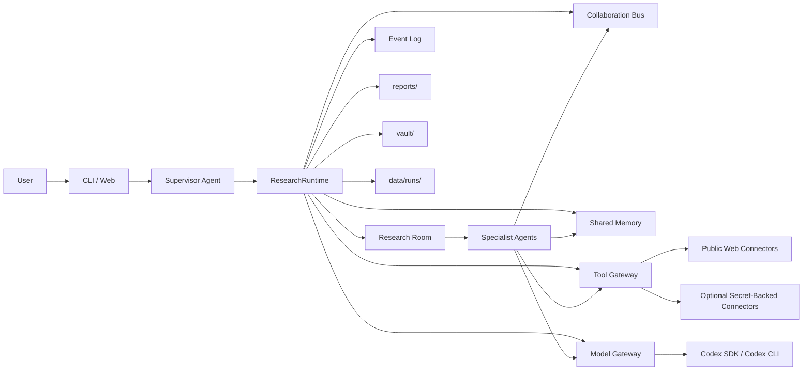

# JIMMORIA Project Structure

이 문서는 JIMMORIA의 현재 구조, 에이전트 역할, 실행 흐름, 도구 정책, 저장 위치, 병렬화 로드맵을 설명한다.

JIMMORIA는 크립토 가격 매매 도구가 아니라 리서치 전용 멀티에이전트 회사다. 사용자는 CLI 또는 로컬 웹 대시보드에서 Supervisor와 대화하고, Supervisor는 보고서나 dossier 작성이 명확히 요청될 때만 Research Room을 열어 하위 에이전트에게 작업을 배정한다.

## 1. 현재 방향

현재 기본 방향은 **public web first research stack**이다.

기본 리서칭 도구는 웹에서 접근 가능한 공개 소스와 read-only connector 중심으로 제한한다.

- Web search
- URL fetch
- HTML parsing
- Official website crawler
- Docs crawler
- GitHub search and public repo reader
- DEX Screener public metadata
- CoinGecko public metadata
- RootData API, optional secret-backed
- X/Twitter public search and KOL timeline, optional secret-backed
- Explorer/RPC read-only checks, optional secret-backed
- RSS/public feed monitoring, planned

Telegram과 Discord는 현재 기본 connector stack에서 제외한다. 프로젝트 공식 웹사이트에서 Telegram/Discord 링크가 발견될 수는 있지만, JIMMORIA는 Telegram Bot, Discord Bot, private channel reader, private chat scraping을 정상 리서치 경로로 요구하지 않는다.

## 2. 목표

JIMMORIA의 핵심 목표는 "채팅으로 조종하는 크립토 리서치 회사"다.

주요 작업:

- 사용자가 준 질문, URL, 텍스트, 파일을 리서치 소스로 저장
- 프로젝트 공식 웹사이트, docs, GitHub, market metadata, explorer identity 확인
- 초기 프로젝트 후보 발굴
- KOL/X/public web 기반 소셜 맥락 확인
- RootData, CoinGecko, DEX Screener, explorer를 이용한 프로젝트 식별 보강
- Agent Council을 통한 합의와 리스크 정리
- Supervisor final review 후 Markdown 보고서와 Obsidian-style note 생성
- 나중에 웹 UI에서 replay할 수 있도록 이벤트 로그 저장

## 3. Top-Level Structure

```text
jimmoria/
  crypto_research_agents/
    cli.py
    console.py
    runtime.py
    agents/
    connectors/
    core/
    storage/
    web/

  config/
    agents/
    tools/
    processes/
    models/
    concurrency.yaml
    toolsets.yaml
    profiles.yaml
    jobs.yaml

  docs/
    jimmoria-project-structure.md

  research_playbooks/
  templates/
  tests/

  data/
  reports/
  vault/
```

`crypto_research_agents/`는 실행 코드, `config/`는 회사 운영 정책, `data/`, `reports/`, `vault/`는 로컬 실행 산출물이다.

## 4. Entry Points

```text
jimmoria                    CLI Research HQ
jimmoria hq                 CLI Research HQ
jimmoria chat               CLI Research HQ
jimmoria web                Local web dashboard
jimmoria demo               Demo run
jimmoria doctor             Capability check
jimmoria runs               Previous runs
jimmoria status <room_id>   Room status
jimmoria messages <room_id> Collaboration messages
jimmoria events <room_id>   Replay events
jimmoria report <room_id>   Saved report
```

`pyproject.toml` script:

```toml
[project.scripts]
jimmoria = "crypto_research_agents.cli:main"
crypto-research = "crypto_research_agents.cli:main"
```

## 5. Runtime Architecture



핵심 레이어:

| Layer | File | Role |
|---|---|---|
| CLI | `crypto_research_agents/cli.py` | 명령어, 채팅 루프, Supervisor intake |
| Console | `crypto_research_agents/console.py` | 터미널 UI, 로고, 입력 dock, 로그 표시 |
| Runtime | `crypto_research_agents/runtime.py` | Research Room 생성과 agent 실행 |
| Research Room | `core/room.py` | 한 개 리서치 작업 단위 |
| Collaboration Bus | `core/bus.py` | 요청, 응답, handoff, update 기록 |
| Shared Memory | `core/memory.py` | sources, candidates, findings, entity graph |
| Tool Gateway | `core/tool_gateway.py` | tool 권한, connector 호출, audit log |
| Model Gateway | `core/model_gateway.py` | task type별 Codex model route |
| Concurrency Policy | `core/concurrency.py`, `config/concurrency.yaml` | Phase 1-4 병렬화 정책 |
| Storage | `storage/` | run snapshot, reports, vault notes |
| Web Dashboard | `web/` | 로컬 구조/런타임 시각화 |

## 6. Supervisor Role

Supervisor는 단순 라우터가 아니라 회사의 boss/orchestrator다.

역할:

- 사용자 발화를 먼저 읽고 대화/설정/리서치/보고서 조회 요청을 구분
- Research Room이 필요한지 판단
- 보고서/dossier 작성 요청이면 사용자에게 확인 후 room open
- 저장 보고서 조회가 실패한 뒤 사용자가 "만들어/작성해"라고 정정하면 직전 요청을 새 보고서 작성 요청으로 복구
- 목표, 우선순위, task plan 생성
- 하위 agent에게 작업 배정
- Agent Council 결과를 받아 최종 검토
- 보고서가 충분한지, evidence가 부족한지 판단
- 사용자에게 최종 응답 전달

일상 대화, 설정 변경, 단순 "조사해봐/알아봐" 요청은 report를 만들지 않고 Supervisor가 직접 응답한다. Research Room은 "보고서 작성해봐", "dossier 만들어봐", "리서치 보고서 생성해줘"처럼 최종 산출물 작성이 명확한 경우에만 열린다.

## 7. Agent Roster

| Agent | Role | Current Behavior |
|---|---|---|
| `supervisor_agent` | Boss / orchestrator | 요청 분류, 계획, 배정, 최종 검토 |
| `ingestion_agent` | Archivist | 소스 저장, metadata/entity/keyword 추출 |
| `narrative_agent` | Thesis mapper | 시장 narrative 분류 |
| `discovery_agent` | Scout | public evidence 기반 후보 프로젝트 발굴 |
| `social_kol_agent` | Signal listener | public web, official X links, X/KOL evidence 확인 |
| `contract_onchain_agent` | Chain verifier | chain/token/contract/explorer/DEX identity 확인 |
| `product_tech_agent` | Product analyst | website, docs, GitHub, product readiness 확인 |
| `funding_token_agent` | Opportunity analyst | investor, points, airdrop, token status hint 확인 |
| `report_agent` | Research editor | findings를 dossier로 작성 |
| `obsidian_curator_agent` | Knowledge curator | vault note 생성 |
| `monitor_24h_agent` | Planned watcher | public web/X/GitHub/docs/RSS/DEX/RootData signal queue 예정 |

## 8. Tool Policy

도구 정책은 `config/toolsets.yaml`과 `config/tools/tool_registry.yaml`에 정의된다.

기본 원칙:

- read-only research만 허용
- wallet signing, trading, transfer, approval은 차단
- Telegram/Discord private connector는 기본 스택에서 제외
- secret이 없는 connector는 조용히 실패하지 않고 `missing_secret` 또는 `missing_input`으로 기록
- 모든 tool call은 audit log에 남김

### Works Without Secrets

```text
web_search
fetch_url
parse_html
crawl_website
crawl_docs
github_search_repos
read_github_repo
coingecko_coin_metadata
dexscreener_search_pairs
check_airdrop_points
archive_source_snapshot
supervisor_office tools
local artifact/report/note writing
```

### Optional Secret-Backed Tools

```text
X_BEARER_TOKEN       x_search_posts, x_get_user_timeline, x_build_kol_list
ROOTDATA_API_KEY     rootdata_search_projects, rootdata_get_project
ETHERSCAN_API_KEY    explorer_lookup, contract source/supply/holders
ETH_RPC_URL          rpc_read_contract
```

Not required:

```text
TELEGRAM_BOT_TOKEN
DISCORD_BOT_TOKEN
```

## 9. Research Room Flow

Current Phase 1 runtime is sequential.

```text
1. Supervisor intake
2. User confirmation when needed
3. Research Room creation
4. Supervisor planning
5. Ingestion
6. Narrative
7. Discovery
8. Social/KOL
9. Contract/On-chain
10. Product/Tech
11. Funding/Token
12. Agent Council
13. Report writing
14. Supervisor final review
15. Obsidian sync
16. Run snapshot and replay events saved
```

## 10. Concurrency Roadmap

`config/concurrency.yaml` controls active phase.

| Phase | Status | Mode | Description |
|---|---|---|---|
| Phase 1 | active | sequential | Whole Research Room runs sequentially for stability |
| Phase 2 | planned | bounded parallel group | After Discovery, Social / Contract / Product / Funding evidence checks run together |
| Phase 3 | planned | background workers | X, GitHub, Docs, DEX, RSS, RootData, public web monitors run in parallel |
| Phase 4 | planned | room worker pool | Candidate A/B/C get separate Research Rooms, then summaries are merged |

Safety rules:

- SharedMemory writes stay serialized
- Report writing is single-writer
- Obsidian sync is single-writer
- Tool calls remain read-only or artifact-write only
- Agent Council is the join point before final synthesis

## 11. Storage

```text
data/memory.json
data/company_settings.json
data/model_settings.json
data/runs/<room_id>/room.json
data/runs/<room_id>/messages.json
data/runs/<room_id>/events.json
data/runs/<room_id>/tool_audit_log.json
data/runs/<room_id>/llm_call_log.json
reports/*.md
vault/10_Projects/*.md
vault/20_Sources/*.md
vault/30_Narratives/*.md
vault/50_Reports/*.md
```

Workflow artifact runs also write:

```text
workflow.yaml
workflow_trace.json
events.jsonl
messages.jsonl
tool_calls.jsonl
sources.json
findings.json
candidates.json
report.md
report.compact.md
report.json
```

## 12. Web Dashboard

`jimmoria web` starts a local dashboard that reads existing files from:

- `data/runs`
- `reports`
- `vault`

It is intended for:

- company structure visualization
- live/replayed agent board
- Research Room status
- report preview
- event replay

## 13. Tests

```powershell
python -m unittest discover -s tests -v
```

Important test coverage:

- Supervisor chat vs research request routing
- no-report behavior for settings/conversation
- process specs
- tool registry and toolsets
- web dashboard payloads
- concurrency policy
- quality gate
- report evidence checks
- Codex provider routing
- public-web connector stack

## 14. Current Limits

- Phase 1 is still sequential by design.
- X/RootData/Explorer/RPC need optional secrets for live API results.
- RSS and advanced monitor workers are planned.
- Telegram/Discord private chat connectors are intentionally out of scope for the current default stack.
- Reports still depend on source-backed evidence; insufficient evidence produces a diagnostic report rather than a final dossier.

## 15. Next Development Order

1. Keep Phase 1 stable with web-only public research stack.
2. Improve official-source extraction and identity validation.
3. Add stronger project identity collision checks.
4. Improve X/KOL handling without relying on private chat channels.
5. Implement Phase 2 parallel evidence checks.
6. Implement Phase 3 public web/RSS/GitHub/docs/DEX monitor workers.
7. Expand web dashboard replay and multi-room board.
8. Add Phase 4 parallel Research Rooms for candidate fanout.

## 16. One-Line Summary

JIMMORIA is currently a Codex-first, public-web-first multi-agent crypto research company with Supervisor orchestration, controlled P2P collaboration, shared memory, read-only ToolGateway, Markdown/Obsidian outputs, and a Phase 1 sequential runtime preparing for staged parallelization.
