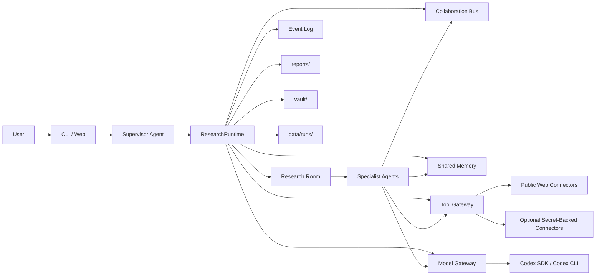

# JIMMORIA Project Structure

이 문서는 JIMMORIA의 현재 구조, 에이전트 역할, 실행 흐름, 도구 정책, 저장 위치, 병렬화 로드맵을 설명한다.

JIMMORIA는 크립토 가격 매매 도구가 아니라 리서치 전용 멀티에이전트 회사다. 사용자는 CLI 또는 로컬 웹 대시보드에서 Supervisor와 대화하고, Supervisor는 보고서나 dossier 작성이 명확히 요청될 때만 Research Room을 열어 하위 에이전트에게 작업을 배정한다.

## 1. 현재 방향

현재 기본 방향은 **public web first research stack**이다.

기본 리서칭 도구는 웹에서 접근 가능한 공개 소스와 read-only connector 중심으로 제한한다.

- Web search
- URL fetch
- HTML parsing
- Official website crawler
- Docs crawler
- GitHub search and public repo reader
- DEX Screener public metadata
- CoinGecko public metadata
- RootData API, optional secret-backed
- X/Twitter public search and KOL timeline, optional secret-backed
- Explorer/RPC read-only checks, optional secret-backed
- RSS/public feed monitoring, planned

Telegram과 Discord는 현재 기본 connector stack에서 제외한다. 프로젝트 공식 웹사이트에서 Telegram/Discord 링크가 발견될 수는 있지만, JIMMORIA는 Telegram Bot, Discord Bot, private channel reader, private chat scraping을 정상 리서치 경로로 요구하지 않는다.

## 2. 목표

JIMMORIA의 핵심 목표는 "채팅으로 조종하는 크립토 리서치 회사"다.

주요 작업:

- 사용자가 준 질문, URL, 텍스트, 파일을 리서치 소스로 저장
- 프로젝트 공식 웹사이트, docs, GitHub, market metadata, explorer identity 확인
- 초기 프로젝트 후보 발굴
- KOL/X/public web 기반 소셜 맥락 확인
- RootData, CoinGecko, DEX Screener, explorer를 이용한 프로젝트 식별 보강
- Agent Council을 통한 합의와 리스크 정리
- Supervisor final review 후 Markdown 보고서와 Obsidian-style note 생성
- 나중에 웹 UI에서 replay할 수 있도록 이벤트 로그 저장

## 3. Top-Level Structure

```text
jimmoria/
  crypto_research_agents/
    cli.py
    console.py
    runtime.py
    agents/
    connectors/
    core/
    storage/
    web/

  config/
    agents/
    tools/
    processes/
    models/
    concurrency.yaml
    toolsets.yaml
    profiles.yaml
    jobs.yaml

  docs/
    jimmoria-project-structure.md

  research_playbooks/
  templates/
  tests/

  data/
  reports/
  vault/
```

`crypto_research_agents/`는 실행 코드, `config/`는 회사 운영 정책, `data/`, `reports/`, `vault/`는 로컬 실행 산출물이다.

## 4. Entry Points

```text
jimmoria                    CLI Research HQ
jimmoria hq                 CLI Research HQ
jimmoria chat               CLI Research HQ
jimmoria web                Local web dashboard
jimmoria demo               Demo run
jimmoria doctor             Capability check
jimmoria runs               Previous runs
jimmoria status <room_id>   Room status
jimmoria messages <room_id> Collaboration messages
jimmoria events <room_id>   Replay events
jimmoria events <room_id> --after-seq <N>
                            Replay events after a cursor
jimmoria fork <room_id> --seq <N>
                            Fork a room from an event checkpoint
jimmoria report <room_id>   Saved report
```

`pyproject.toml` script:

```toml
[project.scripts]
jimmoria = "crypto_research_agents.cli:main"
crypto-research = "crypto_research_agents.cli:main"
```

## 5. Runtime Architecture



핵심 레이어:

| Layer | File | Role |
|---|---|---|
| CLI | `crypto_research_agents/cli.py` | 명령어, 채팅 루프, Supervisor intake |
| Console | `crypto_research_agents/console.py` | 터미널 UI, 로고, 입력 dock, 로그 표시, live agent board |
| Runtime | `crypto_research_agents/runtime.py` | Research Room 생성과 agent 실행 |
| Research Room | `core/room.py` | 한 개 리서치 작업 단위 |
| Collaboration Bus | `core/bus.py` | 요청, 응답, handoff, update 기록 |
| Shared Memory | `core/memory.py` | sources, candidates, findings, entity graph |
| Tool Gateway | `core/tool_gateway.py` | tool 권한, connector 호출, audit log |
| Model Gateway | `core/model_gateway.py` | task type별 Codex model route, pro reasoning effort |
| Usage Meter | `core/usage.py` | LLM duration/token usage extraction, fallback estimation, room/agent aggregation |
| Concurrency Policy | `core/concurrency.py`, `config/concurrency.yaml` | Phase 1-4 병렬화 정책 |
| Storage | `storage/` | run snapshot, reports, vault notes |
| Web Dashboard | `web/` | 로컬 구조/런타임 시각화 |

## 5.1 CLI Runtime TUI Dock

`crypto_research_agents/console.py`는 Research Room 실행 중 lightweight TUI dock을 계속 유지한다.

화면 모델은 다음과 같다.

```text
scrolling transcript
  You > ...
  Supervisor > ...
  Room > ...
  Agent > ...
  Tool > ...
  Output > ...

fixed runtime dock
  JIMMORIA HQ status line
  room/provider/agent progress
  Live agent board - current work
  each agent state: WAIT / RUN / DONE / FAIL
  each agent activity: current assignment or latest tool call
  locked input line with blinking working dots
```

이 dock은 runtime event가 들어올 때마다 다시 그려진다. 새 이벤트 로그를 찍기 전에 이전 dock을 ANSI cursor movement로 지우고, 로그를 출력한 뒤, 최신 agent state로 dock을 다시 그린다. 그래서 터미널 scrollback은 유지하면서도 아래쪽 status/input 영역은 고정된 TUI처럼 보인다.

Tool event도 board를 갱신한다. 예를 들어 `discovery_agent`가 `web_search`를 호출하면 해당 row는 `Waiting: Resolving candidates`에서 `Now: Tool running: web_search - ...`로 바뀐다. Agent가 끝나면 `Finished: ...`로 바뀐다.

Latest runtime dock behavior:

```text
JIMMORIA HQ status line
Now: active_agent -> current work | Waiting: next agents
Room running notice
Live agent board - current work
STATE  AGENT                         CURRENT WORK
RUN    supervisor_agent              Now: Planning direction
WAIT   ingestion_agent               Waiting: Extracting source metadata
...
> working...
```

The active summary line exists so the user can still see the current worker even if terminal scrollback or ANSI rendering hides part of the full board. The full board uses the current terminal width up to a wider cap, so long agent names such as `contract_onchain_agent` and `obsidian_curator_agent` remain visible during research rooms.

## 5.2 Model Routing

JIMMORIA는 현재 Codex-only 모델 정책을 사용한다.

```text
supervisor_chat       gpt-5.4-mini, standard by default
source_ingestion      gpt-5.5, pro reasoning
supervision           gpt-5.5, pro reasoning
narrative_reasoning   gpt-5.5, pro reasoning
candidate_discovery   gpt-5.5, pro reasoning
social_summary        gpt-5.5, pro reasoning
contract_info         gpt-5.5, pro reasoning
product_docs          gpt-5.5, pro reasoning
funding_token         gpt-5.5, pro reasoning
obsidian_sync         gpt-5.5, pro reasoning
report_writing        gpt-5.5, pro reasoning
final_synthesis       gpt-5.5, pro reasoning
```

`CODEX_REASONING_EFFORT=pro`는 ModelGateway에서 `reasoning_effort=pro`로 기록되고, Codex CLI provider는 `codex exec --config model_reasoning_effort="xhigh"`로 매핑한다. 이 값은 `data/runs/<room_id>/llm_call_log.json`에도 남아 나중에 어떤 작업이 어느 노력도로 실행됐는지 확인할 수 있다.

### 5.2.1 Grok/xAI Provider

JIMMORIA is Codex-first, but the model gateway can now route agents through Grok/xAI as a second live provider.

```text
Codex defaults
  supervisor_chat       gpt-5.4-mini, standard by default
  source_ingestion      gpt-5.5, pro reasoning
  specialist agents     gpt-5.5, pro reasoning
  report/final writing  gpt-5.5, pro reasoning

Grok defaults
  supervisor_chat       grok-4.3, standard by default
  source_ingestion      grok-4.3, pro -> reasoning.effort high
  specialist agents     grok-4.3, pro -> reasoning.effort high
  report/final writing  grok-4.3, pro -> reasoning.effort high
```

Grok credential sources:

```text
Hermes xAI OAuth session
  hermes auth add xai-oauth
  LLM_PROVIDER=xai_oauth
  stored by Hermes in ~/.hermes/auth.json

XAI_API_KEY
GROK_API_KEY
GROK_OAUTH_TOKEN / XAI_OAUTH_TOKEN
GROK_OAUTH_TOKEN_FILE / XAI_OAUTH_TOKEN_FILE
GROK_OAUTH_TOKEN_COMMAND / XAI_OAUTH_TOKEN_COMMAND
```

`LLM_PROVIDER=xai_oauth` prefers the Hermes OAuth session over API-key env vars. `LLM_PROVIDER=grok` keeps API-key/env sources first and falls back to Hermes OAuth if no explicit bearer exists.

Raw Grok/XAI bearer tokens are not saved in `data/model_settings.json`. Only provider choice, file paths, commands, base URL, API mode, and model route preferences are persisted. When Hermes is installed in the same Python environment, JIMMORIA asks `hermes_cli.auth.resolve_xai_oauth_runtime_credentials()` for a refreshed runtime bearer. If that module is not importable, it falls back to reading `~/.hermes/auth.json` directly without printing token values.

`CODEX_REASONING_EFFORT=pro` remains the shared effort control. Codex CLI maps it to `model_reasoning_effort="xhigh"` where supported. Grok maps it to xAI Responses API `reasoning.effort="high"` for `grok-4.3`; `grok-4.20-multi-agent` maps pro to `xhigh`.

## 6. Supervisor Role

Supervisor는 단순 라우터가 아니라 회사의 boss/orchestrator다.

역할:

- 사용자 발화를 먼저 읽고 대화/설정/리서치/보고서 조회 요청을 구분
- Research Room이 필요한지 판단
- 보고서/dossier 작성 요청이면 사용자에게 확인 후 room open
- 사용자가 y/Enter로 승인한 뒤에는 중복 Supervisor 설명 박스를 출력하지 않고 바로 room/agent event stream으로 전환
- 저장 보고서 조회가 실패한 뒤 사용자가 "만들어/작성해"라고 정정하면 직전 요청을 새 보고서 작성 요청으로 복구
- `3jane`처럼 숫자로 시작하는 프로젝트명도 추출하고, 보고서 작성 요청이면 public web discovery를 우선 수행
- 목표, 우선순위, task plan 생성
- 하위 agent에게 작업 배정
- Agent Council 결과를 받아 최종 검토

## 6.1 Project Evidence Profiles

Project-specific seed evidence is stored outside agent code in:

```text
config/project_profiles/
```

The first profile is:

```text
config/project_profiles/3jane.yaml
```

A profile can contain:

- aliases and display name
- official website and official X
- search queries
- identity hint URLs
- docs / whitepaper / GitHub / article references
- address registry hints
- funding context
- article notes

This reduces agent-code hardcoding. The profile is not treated as final truth; it is a seed packet. Reports still mark claims as `confirmed`, `partial`, or `unverified` through the claim-level evidence ledger.

## 6.2 Claim-Level Evidence Ledger

Reports now track key claims separately from raw URL count:

```text
identity
product
social_kol
funding_team
token_onchain
github_activity
live_metrics
```

Each claim stores:

```text
category
claim
verification_status
source_ids
confidence
```

The goal is to stop treating "12 URLs collected" as equivalent to "all important claims verified." A report can have enough URLs while still showing weak founder, GitHub activity, KOL, explorer, or live pool evidence.
- 보고서가 충분한지, evidence가 부족한지 판단
- 사용자에게 최종 응답 전달

일상 대화, 설정 변경, 단순 "조사해봐/알아봐" 요청은 report를 만들지 않고 Supervisor가 직접 응답한다. Research Room은 "보고서 작성해봐", "dossier 만들어봐", "리서치 보고서 생성해줘"처럼 최종 산출물 작성이 명확한 경우에만 열린다.

## 7. Agent Roster

| Agent | Role | Current Behavior |
|---|---|---|
| `supervisor_agent` | Boss / orchestrator | 요청 분류, 계획, 배정, 최종 검토 |
| `ingestion_agent` | Archivist | 소스 저장, metadata/entity/keyword 추출 |
| `narrative_agent` | Thesis mapper | 시장 narrative 분류 |
| `discovery_agent` | Scout | public evidence 기반 후보 프로젝트 발굴 |
| `social_kol_agent` | Signal listener | public web, official X links, X/KOL evidence 확인 |
| `contract_onchain_agent` | Chain verifier | chain/token/contract/explorer/DEX identity 확인 |
| `product_tech_agent` | Product analyst | website, docs, GitHub, product readiness 확인 |
| `funding_token_agent` | Opportunity analyst | investor, points, airdrop, token status hint 확인 |
| `report_agent` | Research editor | findings를 프로젝트 이해 중심의 통합 dossier로 작성 |
| `obsidian_curator_agent` | Knowledge curator | vault note 생성 |
| `monitor_24h_agent` | Planned watcher | public web/X/GitHub/docs/RSS/DEX/RootData signal queue 예정 |

## 8. Tool Policy

도구 정책은 `config/toolsets.yaml`과 `config/tools/tool_registry.yaml`에 정의된다.

기본 원칙:

- read-only research만 허용
- wallet signing, trading, transfer, approval은 차단
- Telegram/Discord private connector는 기본 스택에서 제외
- secret이 없는 connector는 조용히 실패하지 않고 `missing_secret` 또는 `missing_input`으로 기록
- 모든 tool call은 audit log에 남김

운영 플래그:

- `JIMMORIA_SKIP_EXTERNAL_SEARCH=1`: smoke/test 실행에서 외부 네트워크 검색을 끈다. Pearl, 3Jane처럼 공식 identity hint가 있는 프로젝트는 official URL 기반 후보 생성은 계속 가능하다.
- `JIMMORIA_WEB_SEARCH_TIMEOUT`: public web-search connector timeout을 조절해서 느린 검색 provider가 Research Room 전체를 멈추지 않게 한다.

### Works Without Secrets

```text
web_search
fetch_url
parse_html
crawl_website
crawl_docs
github_search_repos
read_github_repo
github_get_repo_activity
rss_monitor_feed
defillama_protocol_search
defillama_tvl_snapshot
snapshot_get_proposals
coingecko_coin_metadata
dexscreener_search_pairs
get_token_metadata
get_dex_pair
check_airdrop_points
archive_source_snapshot
supervisor_office tools
local artifact/report/note writing
```

### Optional Secret-Backed Tools

```text
X_BEARER_TOKEN       x_search_posts, x_get_user_timeline, x_build_kol_list
ROOTDATA_API_KEY     rootdata_search_projects, rootdata_get_project
ETHERSCAN_API_KEY    explorer_lookup, contract source/supply/holders
ETH_RPC_URL          rpc_read_contract
DUNE_API_KEY         dune_execute_query, dune_get_query_results
THEGRAPH_API_KEY     thegraph_query_subgraph
```

Not required:

```text
TELEGRAM_BOT_TOKEN
DISCORD_BOT_TOKEN
```

## 9. Research Room Flow

Current runtime is a full parallel research swarm.

```text
1. Supervisor intake
2. User confirmation when needed
3. Research Room creation
4. Supervisor planning
5. Supervisor seeds shared source and primary candidate context
6. Parallel research_swarm
   - Ingestion
   - Social/KOL market and candidate verification
   - Narrative
   - Discovery
   - Contract/On-chain verification
   - Product/Tech verification
   - Funding/Token verification
7. Agent Council joins specialist findings
8. Report writing
9. Supervisor final review
10. Obsidian sync
11. Run snapshot and replay events saved
```

## 10. Concurrency Roadmap

`config/concurrency.yaml` controls active phase.

| Phase | Status | Mode | Description |
|---|---|---|---|
| Phase 3 | active | full parallel agent swarm | After Supervisor seed context, seven research agents run together |
| Phase 4 | planned | room worker pool | Candidate A/B/C get separate Research Rooms, then summaries are merged |

Safety rules:

- SharedMemory writes are lock-guarded
- Report writing runs after the research swarm joins
- Obsidian sync runs after final review
- Tool calls remain read-only or artifact-write only
- Agent Council is the join point before final synthesis

## 11. Storage

```text
data/memory.json
data/company_settings.json
data/model_settings.json
data/runs/<room_id>/room.json
data/runs/<room_id>/messages.json
data/runs/<room_id>/events.json
data/runs/<room_id>/tool_audit_log.json
data/runs/<room_id>/llm_call_log.json
reports/*.md
vault/10_Projects/*.md
vault/20_Sources/*.md
vault/30_Narratives/*.md
vault/50_Reports/*.md
```

### Runtime Telemetry

Each LLM call now records:

```text
duration_ms
token_usage.input_tokens
token_usage.output_tokens
token_usage.total_tokens
token_usage.estimated
```

If the provider exposes real token usage, JIMMORIA records it. If the provider does not expose usage, such as some Codex CLI runs, JIMMORIA stores an estimated token count and marks it with `estimated: true`.

The runtime aggregates this data into:

```text
events.json agent_done[].duration_ms
events.json agent_done[].llm_usage
events.json room_completed.duration_ms
events.json room_completed.llm_usage
room.json project_card.runtime_metrics
```

The CLI compact stream renders these as `time 1.2s | llm 2 calls / ~4.2k tokens`. The `~` prefix means estimated tokens.

Workflow artifact runs also write:

```text
workflow.yaml
workflow_trace.json
events.jsonl
messages.jsonl
tool_calls.jsonl
sources.json
findings.json
candidates.json
report.md
report.compact.md
report.json
```

### CLI Report Display

Research Room 결과 출력 정책:

- `research_complete`: CLI에서 전체 Markdown 보고서를 `Full report`로 바로 출력한다.
- `insufficient_evidence`: 완성 보고서처럼 보이지 않도록 `Diagnostic preview`만 출력한다.
- 모든 report artifact는 `reports/*.md`에 저장되고, summary에는 저장 경로와 `/report <room_id>` 재출력 명령을 함께 보여준다.
- 사용자가 전체 출력 대신 preview만 원하면 `JIMMORIA_REPORT_DISPLAY=preview`를 설정한다.
- `JIMMORIA_REPORT_DISPLAY=full`은 quality 상태와 상관없이 report 파일 전체를 출력한다.

### Completed Report Shape

완료 보고서의 1차 목표는 에이전트 로그를 보여주는 것이 아니라, 사용자가 프로젝트나 내러티브를 이해하도록 돕는 것이다. 그래서 `research_complete` 보고서는 다음 순서로 작성한다.

```text
1. 대표님용 투자 메모
2. 프로젝트 개요
3. 시장 / 내러티브와 왜 지금인가
4. 제품 / 프로토콜 구조
5. 토큰 / 체인 / 가치 포착
6. 팀 / 펀딩 / KOL
7. 리스크와 반론
8. 다음 실사 질문
9. 확인된 내용 요약
```

즉 ReportAgent는 "누가 무엇을 했는지"나 "어떤 링크를 봤는지"보다 "그 링크와 자료에서 어떤 내용이 확인됐고, 그래서 이 프로젝트를 어떻게 이해해야 하는지"를 앞세운다. 에이전트별 실행 로그, council 토론, tool payload, raw LLM output은 최종 보고서 본문에 넣지 않고 `data/runs/<room_id>/messages.json`, `events.json`, `tool_audit_log.json`, `llm_call_log.json`에 감사 trail로 남긴다.

특히 3Jane 같은 high-signal 프로젝트는 짧은 링크 요약으로 끝내지 않는다. 보고서는 다음을 반드시 풀어쓴다.

- 프로젝트가 무엇을 하는지와 기존 DeFi 구조와 다른 점
- X/KOL/article에서 시장이 어떤 내러티브로 읽고 있는지
- 공식 사이트/docs/whitepaper에서 실제로 확인되는 제품 구조
- 토큰/체인/value-capture가 live인지 roadmap인지
- 팀/펀딩/KOL 신호가 무엇을 의미하고 무엇은 아직 미확인인지
- bull case, bear case, 반론, 다음 실사 질문

### Current Reader-Friendly Report Shape

`research_complete` report output is now written as a reader-friendly project dossier, not an internal agent activity log. The client-facing report uses this shape:

```text
1. 대표님용 투자 메모
2. 프로젝트 개요
3. 시장 / 내러티브와 왜 지금인가
4. 제품 / 프로토콜 구조
5. 토큰 / 체인 / 가치 포착
6. 팀 / 펀딩 / KOL
7. 리스크와 반론
8. 다음 실사 질문
9. 확인된 내용 요약
```

Internal Supervisor final review, agent council notes, tool payloads, raw LLM JSON, execution logs, detailed specialist coverage, and AntSeed peer review stay in `data/runs/<room_id>/` and `data/evidence_packets/<project>-<room_id>.md` instead of being appended to the final report body.

### Twitter/KOL-First Research Flow

Project research now treats X/Twitter, KOL posts, public threads, and related articles as the first market-signal layer. The official site, docs, GitHub, token metadata, and chain/on-chain checks are the verification layer.

The room now behaves like this:

```text
Supervisor plan
-> Supervisor seed source/candidate context
-> Parallel research_swarm
   - Ingestion stores and enriches the source
   - Social/KOL checks X recent search, public site:x.com searches, KOL/article mentions, official/candidate X handles, timeline status, and who-said-what rows
   - Narrative maps thesis categories from seeded source context
   - Discovery resolves identity with web/GitHub/market evidence
   - Contract/On-chain checks chain, token, contract, DEX, explorer evidence
   - Product/Tech checks site, docs, app, GitHub, package/API/live infra
   - Funding/Token checks founder, funding, points, airdrop, token mechanics, and value-capture
-> Agent Council
-> Report
-> Obsidian sync
```

This means Social/KOL is not a later validation desk. It is one of the first workers in the research swarm and asks: who is talking about this, what posts or articles exist, which handles or narratives are appearing, and what each source actually said. Product/Tech and Contract/On-chain run at the same time to verify whether the project is real, documented, shipped, and technically identifiable.

### Hermes-Inspired Tool Guardrails

JIMMORIA now mirrors the useful Hermes pattern of routing every tool call through a guarded gateway without copying unsafe or irrelevant tools into the crypto research company. The added research guardrails are:

| Tool | Purpose |
|---|---|
| `url_safety_check` | Classifies public URLs before they are treated as research evidence. |
| `source_relevance_filter` | Filters source URLs against the resolved project identity before final report inclusion. |
| `tool_call_guardrail` | Records a repeated-failure guardrail pattern so the Supervisor can stop low-value tool loops. |

These are read-only, local connectors. They do not add trading, wallet, Telegram, Discord, or private-channel behavior.

### Hermes Operator Bridge

JIMMORIA also registers Hermes-style operator tool names so agent personas can ask for familiar capabilities while the runtime still enforces the company boundary. These tools are not raw host access; they are mapped to safe local connectors or blocked stubs.

| Operator tool | Runtime mapping |
|---|---|
| `skill_view` | Loads local research playbooks such as representative Web3 diligence and `xurl` mapping. |
| `read_file` | Reads project-local files through a sensitive-path guard. |
| `browser_navigate` | Stateless public URL fetch. |
| `browser_console` | Extracts public page text and links, similar to `document.body.innerText`. |
| `browser_snapshot` | Compact text/link snapshot for evidence packets. |
| `browser_scroll` | Stateless refetch approximation; no persistent browser session yet. |
| `browser_click` | Navigates to a supplied link URL. |
| `search_files` | Keyword search over project-local files without shell access. |
| `execute_code` | Limited deterministic utilities: timestamp, JSON summary, score aggregation. |
| `write_file` | Writes artifacts only under `data/`, `reports/`, or `vault/`. |
| `delegate_task` | Supervisor assignment alias for specialist work. |
| `cronjob` | Lists/evaluates configured local scheduled jobs. |
| `multi_tool_use.parallel` | Records parallel intent; concurrency still follows Phase 1-4 policy. |
| `terminal` | Registered but blocked for agents; use specific read-only connectors instead. |
| `browser_vision`, `vision_analyze` | Future external vision connectors; currently not enabled. |
| `send_message` | Registered but disabled; output delivery stays in CLI/Web/local reports. |

Agent access is role-based:

- Supervisor gets planning, delegation, playbook, cron, and parallel-intent tools.
- Ingestion gets source/file/browser text extraction.
- Social/KOL gets X/public-web/browser snapshots for the first market-signal layer and stores `who_said_what`, official/candidate X sources, timeline checks, KOL/article opinion hits, and public X results.
- Product/Tech gets website/docs/GitHub plus guarded file search and browser text extraction.
- Contract/On-chain and Funding/Token get browser snapshots for official/explorer/funding pages.
- Report gets read/search/score/write tools for evidence packets and final dossiers.

### Agent Persona Updates

The agent specs now include a `professional_output_contract` for Supervisor, Discovery, Product/Tech, Social/KOL, Funding/Token, and Report:

- Supervisor acts as company president and final client-delivery gate.
- Discovery resolves official identity first and avoids choosing GitHub org pages as the project website when an official domain exists.
- Product/Tech separates official product/docs evidence from GitHub code/activity evidence.
- Social/KOL runs market-signal intake before Discovery, then separates official project handles from unrelated personal accounts found by search and records speaker/claim/source rows for the report.
- Funding/Token only marks points or airdrop as `hint_found` when project-specific evidence exists.
- Funding/Token extracts structured funding rows when public evidence supports it, including amount, stage, lead investors, named backers, and funding source links.
- Report writes a Korean-first project intelligence report first and keeps logs/audit trails out of the client-facing body. Links are shown with short display labels, while the full URL remains available in Markdown.
- For known/high-signal projects such as 3Jane, the report includes article/web mention notes, public X statements, official docs interpretation, value-capture analysis, founder/team uncertainty, funding context, and a clear WATCH/TOP/OPERATOR/EXCLUDE stance.

## Representative Web3 Diligence Playbook

JIMMORIA now has a dedicated representative-grade Web3 project/token diligence playbook:

```text
research_playbooks/representative_web3_project_diligence.md
```

This playbook is used when the client asks for a project, token, X profile, contract address, site, or narrative report. The central rule is that the trigger is only a candidate until the Identity Gate passes.

The report order is:

```text
1. Conclusion first
2. Identity Gate: project / ticker / chain / CA / site / X / docs / GitHub / DEX / explorer
3. Product-first explanation
4. X/KOL/article market signal layer
5. Website / docs / app / GitHub / SDK / API / live infra verification
6. Founder dossier
7. Token value-capture
8. On-chain / market background
9. Risk separation
10. TOP / WATCH / OPERATOR / EXCLUDE stance
11. Sources
```

Key rules:

- X/Twitter posts, KOL opinions, public threads, and articles are the first signal layer.
- Official site, docs, GitHub, app, explorer, DEX, and public APIs are the verification layer.
- Telegram and Discord are intentionally out of scope for the current public-web research stack.
- Final reports must explain the project itself first: what it is, what problem it attacks, what narrative it belongs to, what the product mechanics are, who is publicly talking about it, who funded it, and what remains unresolved.
- Agent logs, raw tool payloads, and raw LLM JSON are not client-facing report content. They stay in the run audit files.
- Founder claims must be sourced. Name, school, employer, LinkedIn, GitHub, X, funding, and previous projects are not guessed.
- Token value-capture must separate live mechanics from roadmap claims.
- Contract, LP, holder, liquidity, and market data are background unless they create a fatal risk.
- No hype, buy/sell, target, or guaranteed-return language.
- Evidence Packet and AntSeed-style peer review are saved separately, while the client-facing report stays readable.

Every completed room now writes two client-useful artifacts:

```text
reports/<project>-<room_id>.md
data/evidence_packets/<project>-<room_id>.md
```

The evidence packet contains:

```text
Identity
What changed
Product / Operator Evidence
Founder Dossier
On-chain / Market
Social Signal
Risks
Scores
AntSeed Peer Review
Stance
Source Appendix
```

This keeps the final report focused on project understanding while preserving the audit trail for later review.

## 12. Web Dashboard

`jimmoria web` starts a local dashboard that reads existing files from:

- `data/runs`
- `reports`
- `vault`

It is intended for:

- company structure visualization
- live/replayed agent board
- Research Room status
- report preview
- event replay

### 12.1 AX-Style Event Runtime

Google AX was reviewed as a reference for distributed agent runtime design. JIMMORIA does not import AX as a dependency because the company already has a Supervisor, Research Room, CollaborationBus, ToolGateway, and local Run Store. Instead, the useful runtime ideas were adapted into the existing structure.

Applied ideas:

- Single controller: one Supervisor/ResearchRuntime path controls each room, so state changes stay auditable.
- Sequenced event log: every runtime event now carries a stable `seq`.
- Cursor resume: `jimmoria events <room_id> --after-seq <N>` prints only events after the last sequence the client already saw.
- Checkpoint fork: `jimmoria fork <room_id> --seq <N>` creates a new saved room snapshot from a previous event checkpoint.
- Web trace support: the dashboard normalizes legacy events, shows event sequence numbers, and exposes `event_cursor.last_seq`.

New run snapshot fields:

```text
events.json[].seq
room.json.parent_room_id       only on forked rooms
room.json.forked_from          source room, source seq, created_at
web payload.event_cursor       last_seq and resume hint
```

This makes the current full parallel swarm runtime easier to replay and debug while preserving the audit trail needed for multi-room parallel execution.

## 13. Tests

```powershell
python -m unittest discover -s tests -v
```

Important test coverage:

- Supervisor chat vs research request routing
- no-report behavior for settings/conversation
- process specs
- tool registry and toolsets
- web dashboard payloads
- concurrency policy
- quality gate
- report evidence checks
- Codex provider routing
- public-web connector stack

## 14. Current Limits

- The research swarm now runs ingestion, Social/KOL, narrative, discovery, contract/on-chain, product/tech, and funding/token agents together after Supervisor seed context.
- Council, report writing, final review, and Obsidian sync still run after the swarm joins because they consume the combined evidence.
- X/RootData/Explorer/RPC need optional secrets for live API results.
- RSS, DefiLlama, Snapshot, GitHub activity, CoinGecko, DEX Screener, token metadata, DEX pair lookup, public web search, website/docs crawling, and airdrop hint search are implemented as public-web/read-only connectors.
- Advanced monitor workers are planned; the connector layer now has RSS support ready for them.
- Telegram/Discord private chat connectors are intentionally out of scope for the current default stack.
- Reports still depend on source-backed evidence; insufficient evidence produces a diagnostic report rather than a final dossier.

## 15. Next Development Order

1. Stabilize the full parallel research_swarm under live X/public-web workloads.
2. Improve official-source extraction and identity validation.
3. Add stronger project identity collision checks.
4. Improve X/KOL handling without relying on private chat channels; add better KOL ranking, repeated-mention detection, and article/thread clustering.
5. Add public web/RSS/GitHub/docs/DEX monitor workers as background collectors.
6. Expand web dashboard replay and multi-room board.
7. Add Phase 4 parallel Research Rooms for candidate fanout.

## 16. One-Line Summary

JIMMORIA is currently a Codex-first, public-web-first multi-agent crypto research company with Supervisor orchestration, controlled P2P collaboration, shared memory, read-only ToolGateway, Markdown/Obsidian outputs, and a full parallel research_swarm for the core research agents.
